<div align="center">

# rt-ui

**Дизайн-система Ростелекома на Svelte 5 — пиксель в пиксель, с машинным доказательством**

<!--STATS-->
**374** историй эталона &nbsp;·&nbsp; **374** (100.0%) проходят сверку &nbsp;·&nbsp; **111** компонентов &nbsp;·&nbsp; **1349** иконок &nbsp;·&nbsp; **4** темы &nbsp;·&nbsp; таблица **24/24**
<!--/STATS-->

[Как это работает](docs/DESIGN-SYSTEM-PORT.md) · [Пакет](docs/PACKAGE.md) · [Пример-CRM](#пример-приложение-crm-организации) · [Мобильная версия](#мобильная-версия-и-адаптивность) · [Таблица](src/lib/components/TableGrid/README.md) · [Графики](#7-графики-вне-оригинала) · [Галерея](#разработка)

| 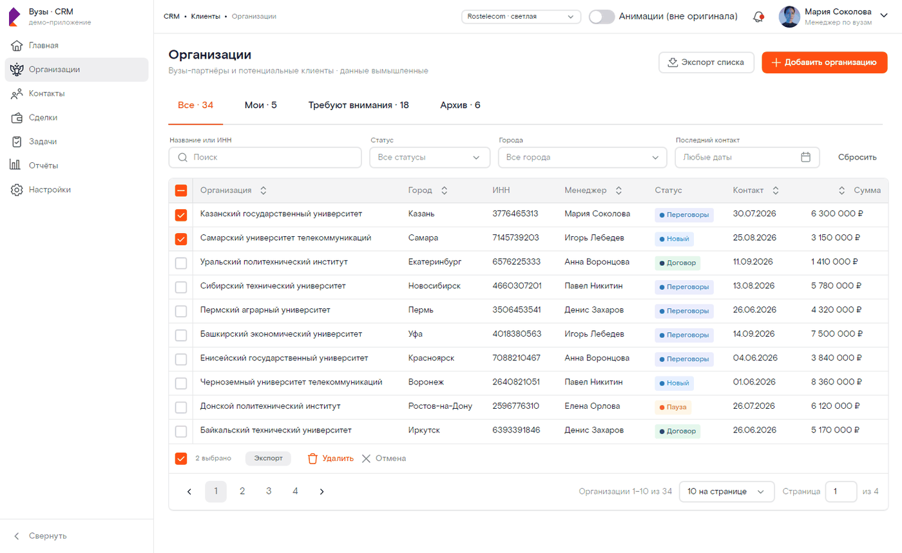 | 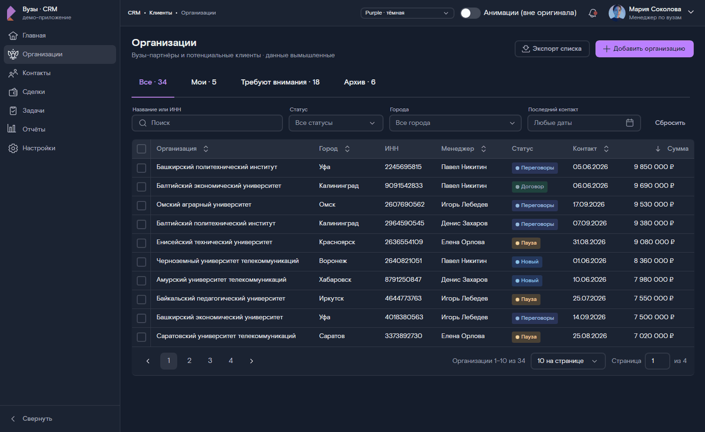 |
|:-:|:-:|
| *CRM «Организации» — Rostelecom · светлая* | *тот же экран — Purple · тёмная* |

<sub>Экран собран только из компонентов библиотеки: SideMenu, TopMenu, Tabs, Input, Select, Multiselect, InputDate, TableGrid, Drawer, Modal, тосты.</sub>

</div>

## Почему это интересно

* **Пиксель в пиксель — и это проверяется.** Для каждой истории эталона сравниваются DOM, геометрия и пиксели во всех состояниях; расхождение не «кажется», а печатается списком с картинками diff.
* **Четыре темы** (Rostelecom и Purple × светлая и тёмная): тема — один CSS-класс, все токены выгружены из эталона, а не подобраны на глаз.
* **`TableGrid` для CRM:** сортировка, фильтры, выбор строк, панель действий, пагинация, раскрытие строк, закреплённые шапка и подвал — все эталонные истории таблицы проходят.
* **API как у React-версии:** те же пропсы, классы и события — документация оригинала остаётся верной, миграция между фреймворками механическая.
* **Адаптивность:** пример-CRM работает на телефоне, планшете и десктопе; для своих приложений есть `useBreakpoint()` и `TableCards` (таблица → карточки).
* **Анимации на Svelte — по желанию, вне оригинала:** выключены по умолчанию; пока их не включили, DOM и поведение оригинальные (и это тоже проверяется). Двигаются оверлеи, календарь, Accordion, Tabs, SideMenu, таблица и тосты.
* **Графики для дашбордов CRM — вне оригинала:** линии, столбцы, кольцо, спарклайны в ячейках таблицы; цвета берутся из токенов, поэтому работают во всех четырёх темах (`@lct-testkit/rt-ui/charts`).
* **Таблица держит десятки тысяч строк:** режим `virtual` рисует 10 000 строк за ~190 мс (в DOM около 30 строк), см. раздел «Производительность» в README таблицы.
* **Закрытый пакет и бесплатный шаг в Svelte для кейсодержателя:** приватный `@lct-testkit/rt-ui` (шрифт и фирменные ассеты в репозиторий не входят); конвейер сверки остаётся и переснимает эталон при обновлении дизайн-системы.

## Как это выглядит

> Все картинки этого файла делает один скрипт — `python tools/screenshots.py` (истории берутся из нашего приложения в режиме `/story/<id>?base=1`).

### Пример-приложение: CRM «Организации»

Готовый экран CRM — [`src/routes/examples/crm`](src/routes/examples/crm), открывается на [`/examples/crm`](http://127.0.0.1:5180/examples/crm) (после `node tools/up.mjs`).
Внутри: меню и шапка с хлебными крошками и меню пользователя, вкладки, панель фильтров (поиск, статус, города, период), таблица на 40 организаций с сортировкой,
выбором строк и пагинацией, карточка организации в Drawer, подтверждение удаления в Modal и тосты. Тема (4 штуки) и авторские анимации («вне оригинала») переключаются в шапке;
ссылка для слайдов — `?theme=rtk_purple_dark&motion=1`. Весь код — на компонентах библиотеки, его можно копировать; сценарий проверяет `python tools/check-crm.py`.

| 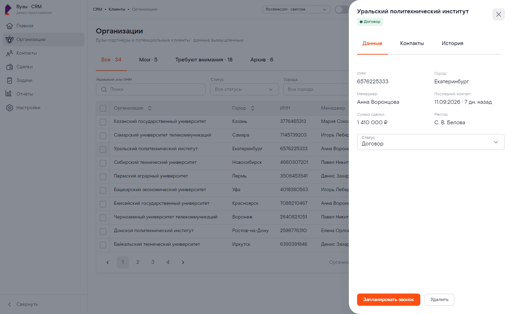 | 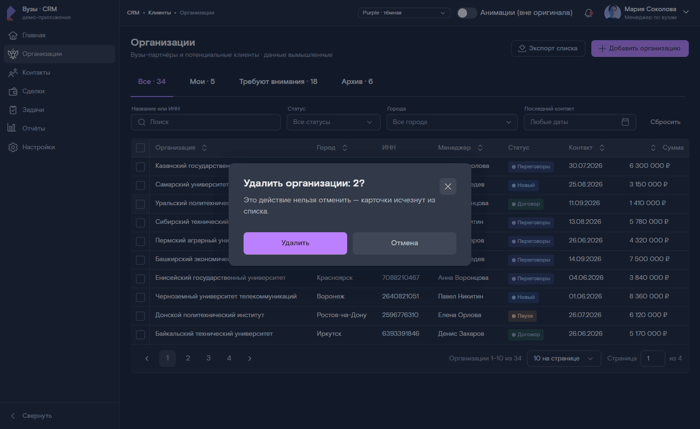 |
|:-:|:-:|
| *карточка в Drawer: вкладки, поля, смена статуса* | *подтверждение в Modal, Purple · тёмная* |

### Мобильная версия и адаптивность

Тот же пример адаптивен: телефон (< 768 px), планшет (768–1023 px) и десктоп. Структура меняется через `useBreakpoint()`, остальное — обычный CSS на токенах.

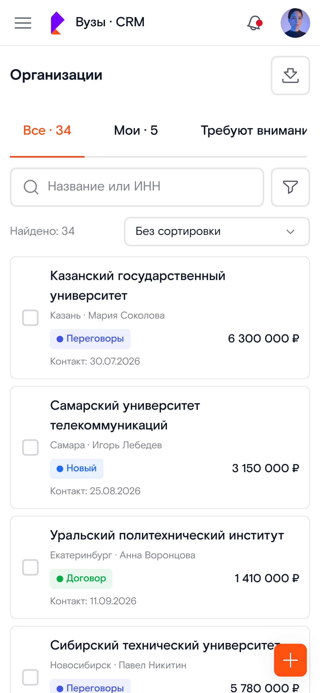

*Телефон 390 px, Rostelecom · светлая: список карточек, фильтры, выбор с панелью действий, карточка организации во весь экран.*

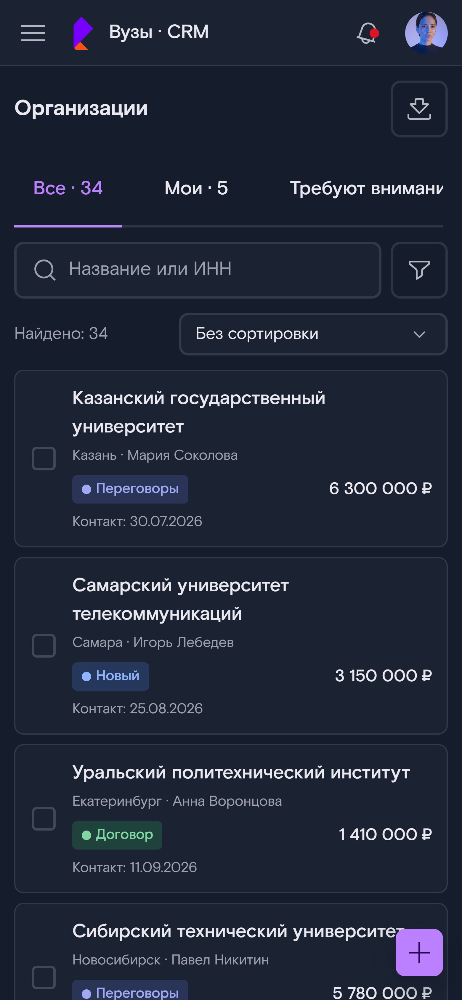

*Те же экраны в Purple · тёмной.*

* **Оболочка:** вместо бокового меню — бургер и `SideMenu` в `Drawer` слева (внизу — переключатели демо: тема и анимации); хлебные крошки заменяет заголовок страницы.
* **Список:** вместо 7-колоночной таблицы — карточки [`TableCards`](src/lib/ext/TableCards.svelte) (те же строки, те же ключи выбора, что у `TableGrid`); сортировка одним `Select`, поиск и кнопка «Фильтры» с числом активных условий, остальные фильтры — в панели под поиском, кнопка «+» — плавающая, панель выбранных карточек прилипает к низу.
* **Окна:** `Drawer` карточки и `Modal` подтверждения занимают экран; поля в один столбец, кнопки во всю ширину.
* **Цели касания:** основные элементы не меньше 44–48 px (`size="l"`), карточка не ниже 64 px.
* **Планшет:** свёрнутое `SideMenu`, таблица без ИНН, менеджера и даты контакта, фильтры в два столбца.

```svelte
<script lang="ts">
  import { useBreakpoint, TableCards } from '@lct-testkit/rt-ui/ext';
  import { TableGrid } from '@lct-testkit/rt-ui';
  const bp = useBreakpoint();                       // bp.isMobile / isTablet / isDesktop, bp.width — реактивны
</script>

{#if bp.isMobile}
  <TableCards {rows} selectable {selected} onSelectionChange={(keys) => (selected = keys)} onRowClick={(row) => open(row.id)}>
    {#snippet card(row)}<b>{row.name}</b> · {row.city}{/snippet}
  </TableCards>
{:else}
  <TableGrid {columns} {rows} />
{/if}
```

Проверка: `python tools/check-crm-mobile.py` (телефон 390×844 с касаниями, 360×640, альбомный 844×390, планшет 768×1024, десктоп: нет горизонтальной прокрутки, списки открываются внутри окна, окна умещаются, цели касания, сценарий целиком, без ошибок консоли).

### Компоненты

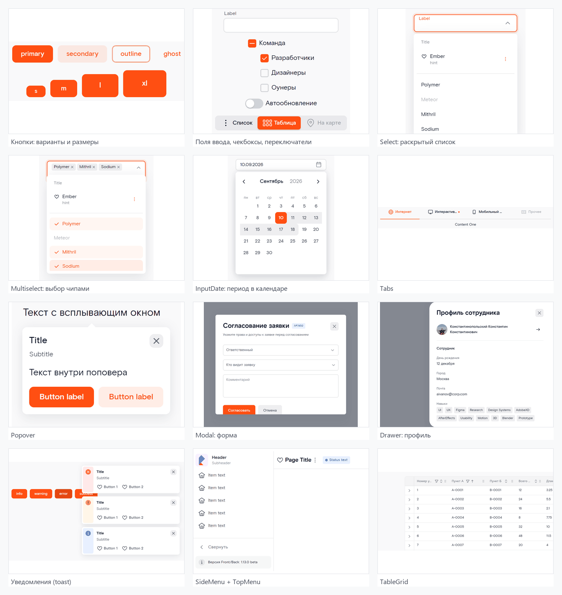

*Контактный лист: кнопки, поля, списки, календарь, окна, тосты, меню и таблица — снимки наших историй.*

| 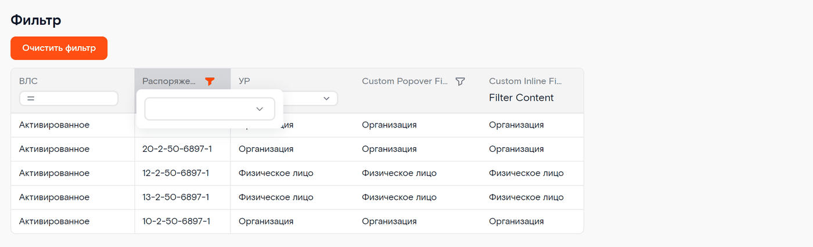 | 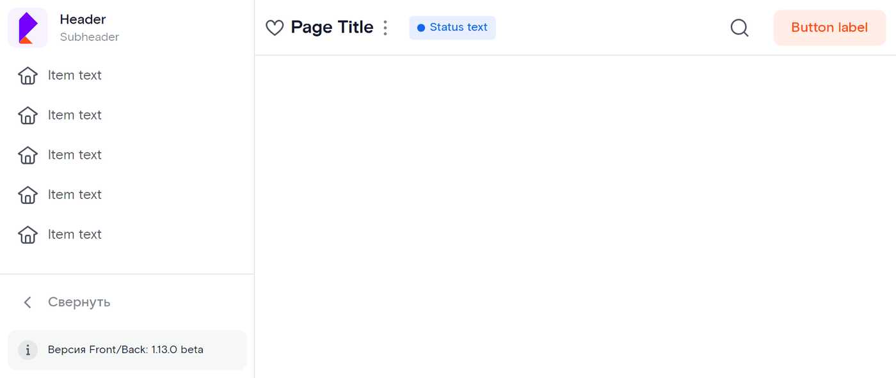 |
|:-:|:-:|
| *TableGrid: фильтры в шапке колонок* | *SideMenu + TopMenu* |
| 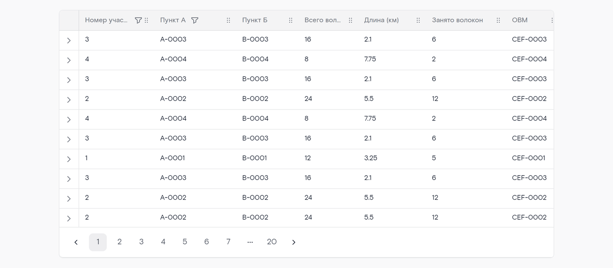 | 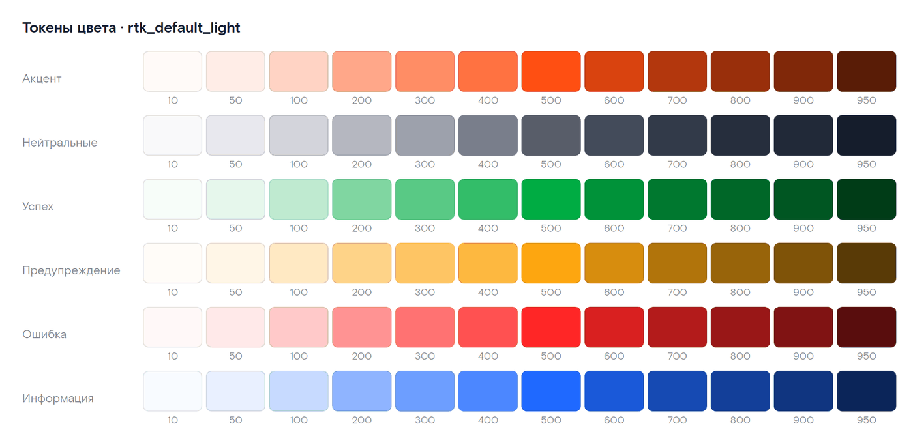 |
| *TableGrid: закреплённые шапка и подвал* | *токены цвета темы (`--atmr-*`)* |

<details>
<summary>Отдельные снимки компонентов</summary>

| 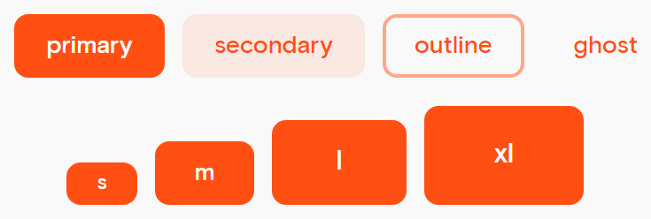 | 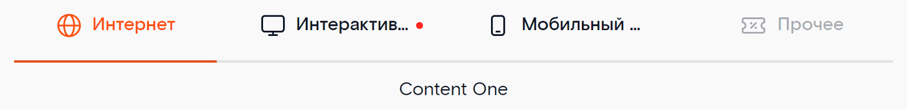 |
|:-:|:-:|
| *кнопки: варианты и размеры* | *Tabs* |
| 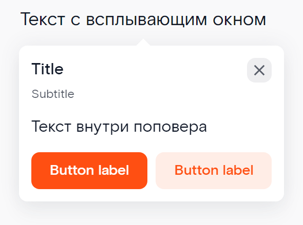 | 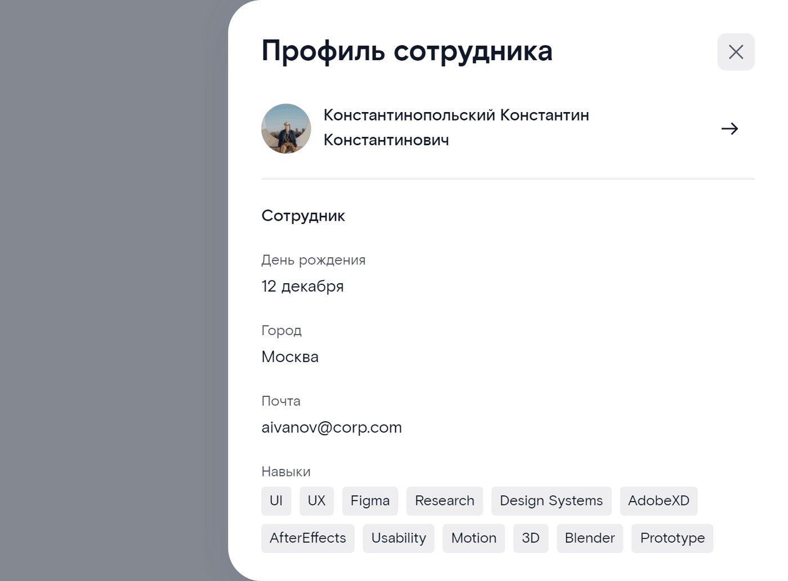 |
| *Popover* | *Drawer* |

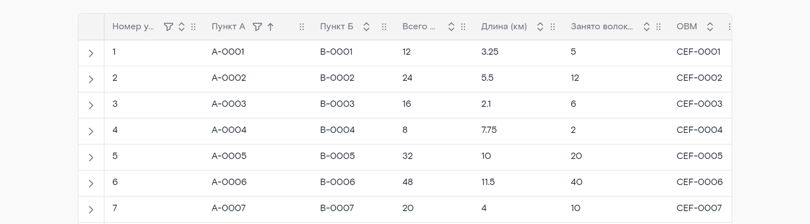

</details>

### Четыре темы

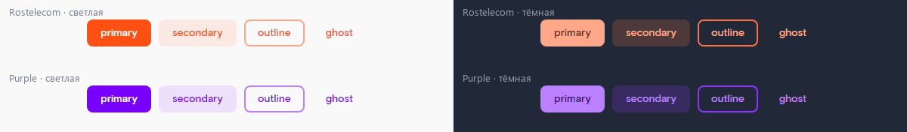

*Одни и те же кнопки в четырёх темах.*

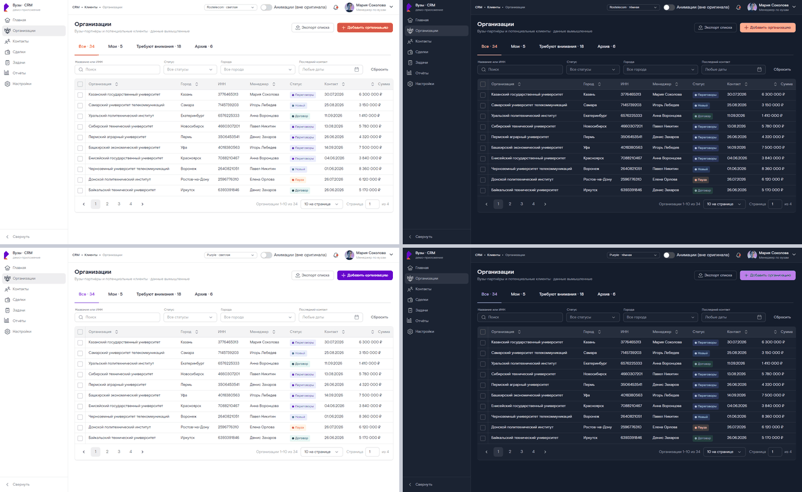

*Пример-приложение в четырёх темах: тема — один класс `Theme_root_<тема>` на `<body>` или на `ThemeProvider`.*

## Быстрый старт

Запустить локально (эталон Storybook на :6006, playground на :5180):

```bash
npm install
node tools/up.mjs
# http://127.0.0.1:5180/examples/crm   пример-приложение
# http://127.0.0.1:5180/gallery        живая галерея: 4 темы, режим «Таблица», сверка «Svelte | React»
# http://127.0.0.1:5180/ext            авторские расширения (анимации)
# http://127.0.0.1:5180/charts         графики
```

Шрифт Rostelecom Basis лицензирован и не хранится в репозитории: положите `RostelecomBasis-{Light,Regular,Medium,Bold}.woff(2)` в `src/lib/styles/fonts/`.

Поставить в своё SvelteKit/Vite-приложение как **приватный** пакет `@lct-testkit/rt-ui` (в публичный npm не публиковать: внутри шрифт и фирменные ассеты):

```bash
npm run package                           # dist/: JS, .svelte, .d.ts, min-CSS, шрифты
npm pack --pack-destination ../           # ../lct-testkit-rt-ui-0.1.0.tgz
npm i ../lct-testkit-rt-ui-0.1.0.tgz      # или file:../rt-ui, git+ssh://..., приватный реестр
```

```svelte
<script lang="ts">
  import '@lct-testkit/rt-ui/styles';    // компоненты + 4 темы + base + шрифт
  import { ThemeProvider, Button, Input } from '@lct-testkit/rt-ui';
  let name = $state('');
</script>

<ThemeProvider theme="rtk_purple_dark">
  <Input label="Имя" value={name} onChange={(e) => (name = e.target.value)} />
  <Button label="Сохранить" onclick={() => alert(name)} />
</ThemeProvider>
```

Тема — проп `theme` (`rtk_default_light` · `rtk_default_dark` · `rtk_purple_light` · `rtk_purple_dark`). Подробно (CSS, темы, шрифты, SSR, deep imports, версии) — [`docs/PACKAGE.md`](docs/PACKAGE.md), история версий — [`CHANGELOG.md`](CHANGELOG.md).

## Примеры использования

Код ниже — из [примера-приложения](src/routes/examples/crm) и историй. В своём проекте импорты идут из пакета (`@lct-testkit/rt-ui`), в этом репозитории — из `$lib/...`.

### 1. Тема, поля и кнопки

```svelte
<script lang="ts">
  import { ThemeProvider, Input, Checkbox, Button } from '@lct-testkit/rt-ui';
  let email = $state('');
  let agree = $state(false);
</script>

<ThemeProvider theme="rtk_default_light">
  <Input label="E-mail" placeholder="name@company.ru" clearable value={email} onChange={(e) => (email = e.target.value)}
    error={email && !email.includes('@') ? 'Проверьте адрес' : undefined} />
  <Checkbox label="Согласен с условиями" checked={agree} onChange={(v) => (agree = v)} />
  <Button label="Отправить" disabled={!agree} onclick={() => alert(email)} />
  <Button variant="outline" colorScheme="neutral" label="Отмена" />
</ThemeProvider>
```

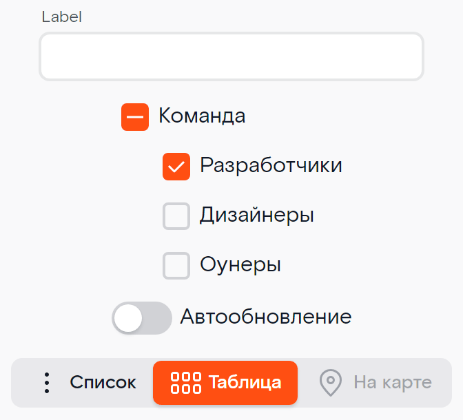

*Значения — как в React: `value` + `onChange`. Контент-пропсы (`label`, `iconPrefix`, …) принимают строку или сниппет.*

### 2. Select и Multiselect с элементами

```svelte
<script lang="ts">
  import { Select, Multiselect } from '@lct-testkit/rt-ui';
  const statuses = [{ key: 'new', value: 'Новый' }, { key: 'talks', value: 'Переговоры' }, { key: 'active', value: 'Договор' }];
  const cities = ['Казань', 'Самара', 'Пермь'].map((c) => ({ key: c, value: c }));
  let status = $state<string | number>('');
  let picked = $state<string[]>([]);
</script>

<Select label="Статус" placeholder="Все статусы" items={statuses} value={status || null} clearable placement="bottom"
  autocomplete={{ enabled: false }} onChange={(key) => (status = key)} onClear={() => (status = '')} />
<Multiselect label="Города" placeholder="Все города" items={cities} clearable placement="bottom"
  onChange={(items) => (picked = items.map((i) => String(i.key)))} />
```

| 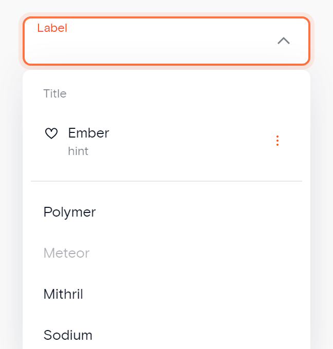 | 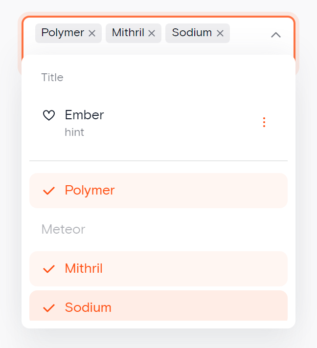 |
|:-:|:-:|
| *Select* | *Multiselect: выбор чипами* |

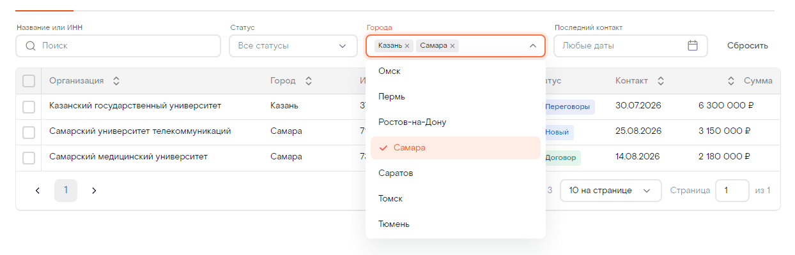

*В примере-CRM тот же Multiselect выбирает города, и таблица фильтруется сразу. `placement="bottom"` — список всегда под полем той же ширины; по умолчанию (`auto`, как в оригинале) Popper выбирает сторону с наибольшим местом.*

### 3. TableGrid: колонки, сортировка, выбор строк, пагинация

<details>
<summary>Код (≈ 35 строк)</summary>

```svelte
<script lang="ts">
  import { TableGrid, ActionBar, Pagination, type TableGridColumn } from '@lct-testkit/rt-ui';

  const orgs = [
    { id: 1, name: 'Казанский государственный университет', city: 'Казань', amount: 6300000 },
    { id: 2, name: 'Самарский университет телекоммуникаций', city: 'Самара', amount: 3150000 }
    /* … */
  ];
  let dir = $state<'asc' | 'desc' | 'default'>('default');
  let selected = $state<string[]>([]);
  let page = $state(1);

  // таблица ничего не сортирует и не режет на страницы: она показывает то, что ей передали
  const sorted = $derived(dir === 'default' ? orgs : [...orgs].sort((a, b) => (dir === 'asc' ? 1 : -1) * (a.amount - b.amount)));
  const rows = $derived(sorted.slice((page - 1) * 10, page * 10).map((o) => ({ ...o, amountText: `${o.amount.toLocaleString('ru-RU')} ₽` })));
  const columns: TableGridColumn[] = $derived([
    { name: 'name', title: 'Организация', size: { width: 'minmax(220px, 2fr)' } },
    { name: 'city', title: 'Город', size: { width: 140 } },
    { name: 'amountText', title: 'Сумма', align: 'right',
      sorting: { sort: dir, onSort: () => (dir = dir === 'default' ? 'asc' : dir === 'asc' ? 'desc' : 'default') } }
  ]);
</script>

{#snippet actionBar()}<ActionBar onDelete={(ids) => console.log('удалить', ids)} />{/snippet}
{#snippet footer()}<Pagination type="buttons" count={orgs.length} {page} pageSize={10} onPageChange={(p) => (page = p)} />{/snippet}

<TableGrid {columns} {rows} alignCells columnConfig={{ sorting: true }} headerSticky footerSticky
  rowConfig={{ selection: { defaultSelected: selected, onSelectionChange: (keys) => (selected = keys) } }}
  renders={{ actionBar, footer }} />
```

</details>


*Справочник `TableGrid` (пропсы, фильтры, вложенные таблицы, бесконечная прокрутка) — [`src/lib/components/TableGrid/README.md`](src/lib/components/TableGrid/README.md). `alignCells` — авторская опция «вне оригинала»: ячейки следуют `column.align`.*

### 4. Modal, Drawer и тосты

<details>
<summary>Код (≈ 30 строк)</summary>

```svelte
<!-- +layout.svelte: один провайдер тостов на приложение -->
<ToastNotificationsProvider position="topRight" maxCount={3}>{@render children()}</ToastNotificationsProvider>
```

```svelte
<script lang="ts">
  import { Modal, Drawer, Button, Typography } from '@lct-testkit/rt-ui';
  import { useNotificationsStack } from '@lct-testkit/rt-ui/components/Notifications/hooks.svelte.js';

  const { addNotification } = useNotificationsStack();      // вызывать внутри ToastNotificationsProvider
  let confirmOpen = $state(false);
  let cardOpen = $state(false);
  const remove = () => {
    confirmOpen = false;
    addNotification({ title: 'Удалено', subtitle: 'Организаций: 2', colorScheme: 'success', closeButton: true, timeout: 5000 });
  };
</script>

<Button label="Удалить" onclick={() => (confirmOpen = true)} />

<Modal isOpened={confirmOpen} maxWidth="520px" maxHeight="220px" isCentered onClickOverlay={() => (confirmOpen = false)} onEsc={() => (confirmOpen = false)}>
  <Typography variant="heading-h2">Удалить организации: 2?</Typography>
  <Button label="Удалить" onclick={remove} />
  <Button variant="secondary" colorScheme="neutral" label="Отмена" onclick={() => (confirmOpen = false)} />
</Modal>

<!-- fullHeight — [вне оригинала]: панель на всю высоту экрана, содержимое прокручивается внутри -->
<Drawer fullHeight dimension={480} isOpened={cardOpen} onClickOverlay={() => (cardOpen = false)}>…карточка…</Drawer>
```

</details>

| 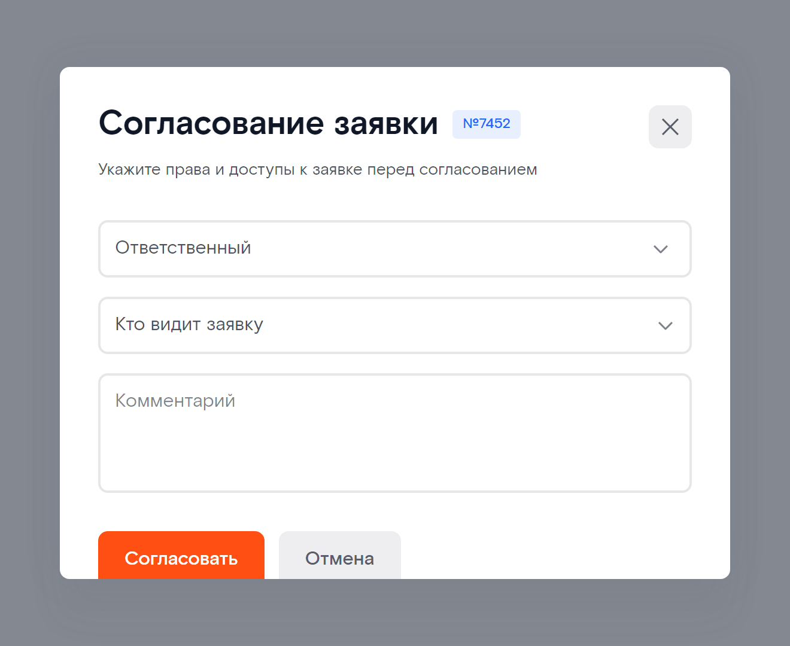 | 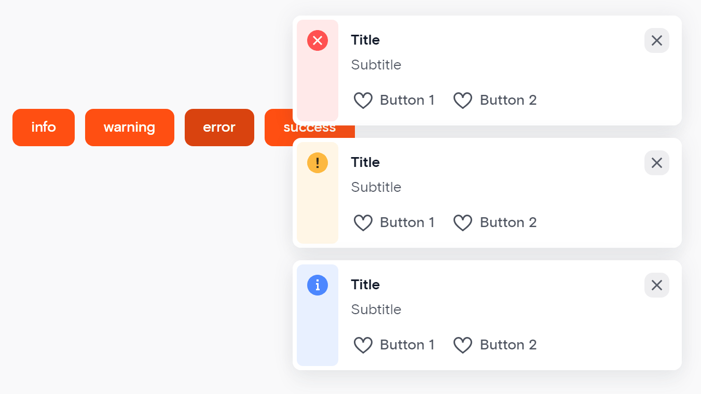 |
|:-:|:-:|
| *Modal* | *тосты: `useNotificationsStack().addNotification`* |

### 5. Даты: InputDate и календарь

```svelte
<script lang="ts">
  import { InputDate } from '@lct-testkit/rt-ui';
  import { MONTHS } from '@lct-testkit/rt-ui/components/PickerDate/constants.js';
  let from = $state<Date | undefined>();
  let to = $state<Date | undefined>();
</script>

<InputDate isRange label="Последний контакт" placeholder="Любые даты" dateFormat="DD.MM.YYYY" months={MONTHS} placement="bottom"
  onChange={(start, end) => { from = start; to = end; }} />
```

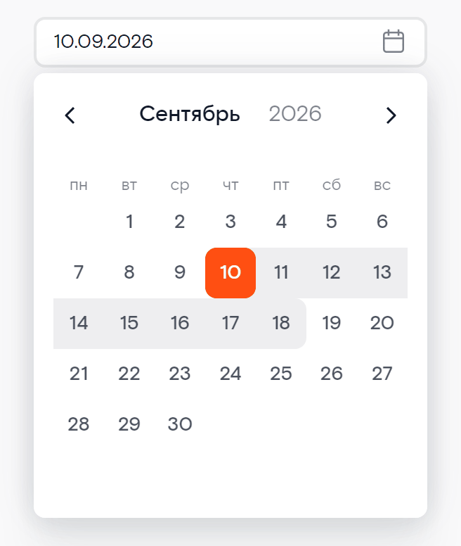

*Без `isRange` — одна дата; `showTime` добавляет время, `minDate` / `maxDate` / `disabledDates` ограничивают выбор. Календарь без поля — `PickerDate`.*

### 6. Анимации на Svelte — вне оригинала, выключены по умолчанию

```svelte
<script lang="ts">
  import { ExtMotionProvider } from '@lct-testkit/rt-ui/ext';
  let motion = $state(false);                       // по умолчанию выключено: оригинальный DOM и поведение
</script>

<ExtMotionProvider mode={motion ? 'svelte' : 'off'} type="spring">
  <App />                                            <!-- Modal, Drawer, Popover, Slider, Wizard, тосты: плавное появление -->
</ExtMotionProvider>
```

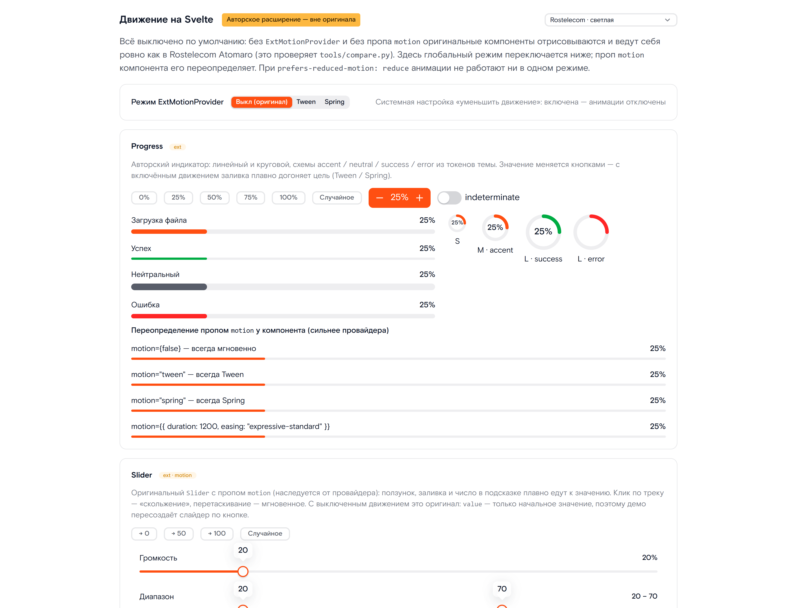

*Живая демонстрация — `/ext`; в примере-CRM тот же переключатель в шапке («Анимации (вне оригинала)»). При `prefers-reduced-motion: reduce` анимации не работают ни в одном режиме.*

### 7. Графики (вне оригинала)

В оригинальной дизайн-системе графиков нет, поэтому это авторский модуль (`src/lib/charts`, отдельный импорт — без него ничего не попадает в бандл):

```svelte
<script lang="ts">
  import { LineChart, DonutChart, Sparkline } from '@lct-testkit/rt-ui/charts';
  const months = [{ month: new Date(2026, 0, 1), fact: 980_000, plan: 950_000 } /* … */];
</script>

<LineChart data={months} x="month" smooth area height={300} label="Выручка по месяцам"
  series={[{ key: 'fact', label: 'Факт', y: 'fact' }, { key: 'plan', label: 'План', y: 'plan', dashed: true }]} />
<Sparkline data={[3, 5, 4, 8, 7, 9]} />                    <!-- маленький график для ячейки TableGrid или карточки -->
```


|  | 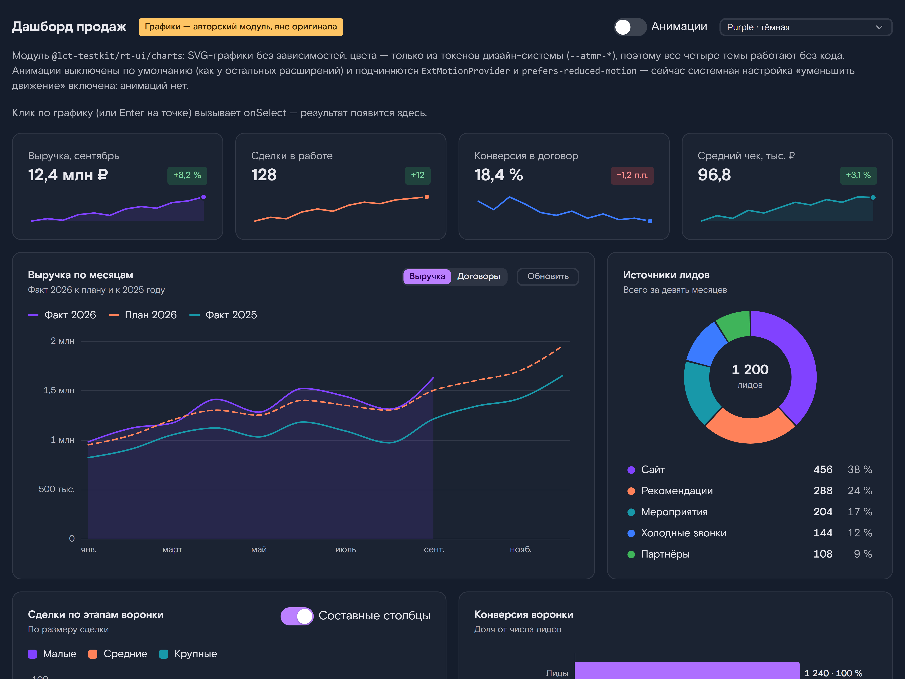 |
|:-:|:-:|
| *те же графики в четырёх темах (цвета — из токенов `--atmr-*`)* | *дашборд, Purple · тёмная* |

*LineChart, BarChart (составные, горизонтальные, воронка), DonutChart и PieChart, Sparkline, легенда-переключатель, подсказка с курсором и клавиатурой; доступность (`role="img"`, сводка для скринридера), `prefers-reduced-motion`. Пять графиков вместе добавляют ~24 КБ gzip, страница без графиков не платит ничего. Живое демо — `/charts`, справочник — [`src/lib/charts/README.md`](src/lib/charts/README.md); проверяет `python tools/check-charts.py`.*

## Как мы доказываем совпадение

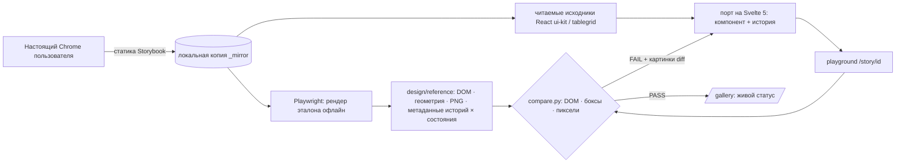
```mermaid
flowchart LR
  A[Настоящий Chrome пользователя] -->|статика Storybook| B[(локальная копия _mirror)]
  B --> C[Playwright: рендер эталона офлайн]
  C --> D[design/reference: DOM · геометрия · PNG · метаданные историй × состояния]
  B --> E[читаемые исходники React ui-kit / tablegrid]
  E --> F[порт на Svelte 5: компонент + история]
  F --> G[playground /story/id]
  G --> H{compare.py: DOM · боксы · пиксели}
  D --> H
  H -->|PASS| I[/gallery: живой статус/]
  H -->|FAIL + картинки diff| F
```

| Уровень | Что сравниваем | Допуск |
|---|---|---|
| **DOM** | теги, атрибуты, классы, `aria-*`, порядок детей, текст, inline-стили, значения полей | точное совпадение |
| **Геометрия** | `getBoundingClientRect` каждого элемента | 0,6 px |
| **Пиксели** | скриншот страницы целиком | 0 (в других темах — 3 уровня канала); отдельно отмечается «AA-only»: не более 12 краевых пикселей (в других темах — 48) с разницей цвета до 40 уровней (до 64) на скруглениях и иконках, `--exact` отключает |

Состояния: `default`, фокус с клавиатуры, `hover`, клик и сценарии поведения (`tools/interactions`: открыть меню, выбрать пункт, стрелки и Enter, ввод, сортировка и фильтры таблицы, Escape, клик вне области).
Темы проверяются тем же способом (`compare.py --theme rtk_purple_dark`). Детали и честные исключения — [`docs/DESIGN-SYSTEM-PORT.md`](docs/DESIGN-SYSTEM-PORT.md).

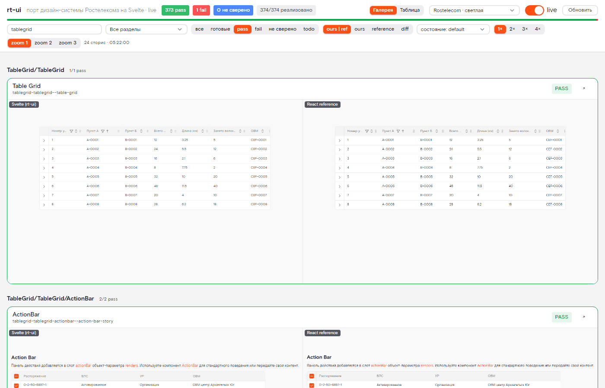

*Галерея `/gallery`: слева наша таблица, справа эталон React, статус — живой. Сама галерея построена на компонентах библиотеки.*

## Что внутри

<!--CATALOG-->
| Категория | Что входит | Историй проходит |
|---|---|---|
| **Основа** | Button, IconButton, FunctionButton, CloseButton, FloatingActionButton, Typography, Box, ScrollBar, иконки, дизайн-токены | 61 / 61 ✅ |
| **Ввод** | Input, InputCard, InputNumberStepper, Textarea, Checkbox, RadioButton, Switch, Slider, Stepper, SegmentedControl | 75 / 75 ✅ |
| **Выбор** | Select, Multiselect, DropdownMenu, Chip, Tag | 51 / 51 ✅ |
| **Даты** | InputDate, PickerDate (день, месяц, год, диапазон, время) | 32 / 32 ✅ |
| **Файлы** | File, FileUpload | 10 / 10 ✅ |
| **Оверлеи** | Modal, Drawer, Popover, Tooltip, Overlay, usePopper | 37 / 37 ✅ |
| **Навигация** | SideMenu, TopMenu, Tabs, Breadcrumbs, Wizard, Accordion | 43 / 43 ✅ |
| **Данные** | TableGrid (+ ActionBar), Tree, Pagination | 41 / 41 ✅ |
| **Обратная связь** | Notification (тосты и inline), Loader, Badge, Counter | 24 / 24 ✅ |
| **Итого** | 44 папок компонентов, 111 экспортов, 1349 иконок | **374 / 374** |
<!--/CATALOG-->

Иконки генерируются из исходников (`tools/gen-icons.mjs`), баррель `src/lib/index.ts` — тоже (`tools/gen-barrel.mjs`).

## Авторские расширения (вне оригинала)

Слой `src/lib/ext/` — **не часть дизайн-системы Ростелекома**. Всё выключено по умолчанию: без провайдера и без соответствующего пропа DOM и поведение оригинальные (это проверяют те же истории `compare.py`).

| Расширение | Что делает | Как включить |
|---|---|---|
| `ExtMotionProvider` | анимации на `transition:` / `animate:flip` / `Spring` / `Tween`: Modal, Drawer, Popover, Tooltip, DropdownMenu, Slider, Wizard, тосты, календарь (листание месяцев), Accordion, индикатор Tabs, SideMenu, строки TableGrid | `mode="svelte"`, проп `motion` у компонента |
| `useBreakpoint`, `useMediaQuery`, `TableCards` | адаптивность: реактивные брейкпоинты и таблица в виде карточек для телефона | импорт из `@lct-testkit/rt-ui/ext` |
| `@lct-testkit/rt-ui/charts` | графики: LineChart, BarChart, DonutChart, PieChart, Sparkline (в оригинале их нет) | отдельный импорт |
| `Progress` | линейный и круговой индикатор | компонент из `@lct-testkit/rt-ui/ext` |
| `TableGrid alignCells` | ячейки следуют `column.align` (в оригинале — только шапка) | проп |
| `Drawer` / `Modal` `fullHeight` | панель на всю высоту экрана, содержимое прокручивается | проп |
| `.rt-base` / `ThemeProvider` | шрифт и цвет текста приложения (оригинальные компоненты наследуют их от корня) | класс на `<body>`, по умолчанию в `ThemeProvider` |

Правила и API — [`src/lib/ext/README.md`](src/lib/ext/README.md).

## Разработка

```bash
node tools/up.mjs                                             # эталон :6006 + playground :5180
python tools/compare.py --match "^components-select" --brief  # сверка выбранных историй
python tools/compare.py --ids components-select--main --theme rtk_purple_dark
python tools/metrics.py                                       # сводка чисел
python tools/fill-docs.py                                     # обновить числа в README и docs/
python tools/screenshots.py                                   # перегенерировать все картинки docs/img
python tools/check-crm.py                                     # сценарий примера-CRM (2 темы, 3 размера окна)
python tools/check-crm-mobile.py                              # мобильная и планшетная версия CRM (--shots docs/img — картинки)
python tools/check-readme.py                                  # ссылки, картинки и код README
python tools/check-charts.py                                  # графики: 4 темы, движение вкл/выкл, подсказки, клавиатура
npm run bench:size && npm run bench:runtime                   # бенчмарки, см. docs/BENCHMARK.md
npm run package                                               # собрать пакет в dist/
npm run check:lib                                            # типы библиотеки (src/lib), то же делает CI
```

```
src/lib/components/   компоненты (по папкам ui-kit); TableGrid/ — таблица с README
src/lib/styles/       темы, CSS компонентов, шрифты (выгружены из эталона 1:1)
src/lib/ext/          авторские расширения (вне оригинала)
src/lib/charts/       графики (вне оригинала): LineChart, BarChart, DonutChart, Sparkline
src/stories/          порты историй эталона (по одному файлу на историю)
src/routes/           /gallery · /story/<id> · /ext · /charts · /examples/crm
tools/                сверка, снимки, метрики, генераторы, скрипты картинок
docs/                 документация и docs/img (картинки этого файла)
design/reference/     снимки эталона: DOM · геометрия · PNG (скрипты картинок их не меняют)
```

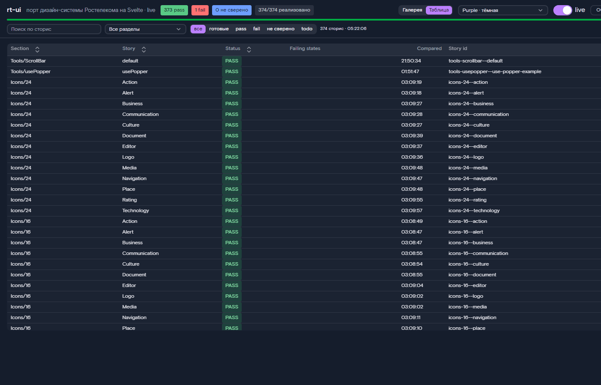

*Галерея в режиме «Таблица»: статус всех историй в нашем `TableGrid`, Purple · тёмная.*

### CI и релизы

`.github/workflows/ci.yml` на каждый push и pull request: `npm ci`, типы библиотеки (`check:lib`), сборка пакета, проверка, что баррель закоммичен, `publint` и `attw`, проверки SSR расширений и графиков, tarball как артефакт сборки. Сверка с эталоном (`compare.py`) и браузерные проверки идут локально: зеркало эталона, снимки и шрифт Rostelecom Basis в репозиторий не входят. Вручную (Actions → CI → Run workflow) можно включить браузерные проверки мобильной версии CRM и графиков.
`.github/workflows/release.yml`: тег `v0.1.1` (равный `version` в `package.json`) → GitHub Release с tarball пакета. Репозиторий держите приватным; tarball из CI без шрифта, шрифт добавляет приложение-потребитель ([`docs/PACKAGE.md`](docs/PACKAGE.md)).

## Ограничения и лицензия

* **Что значит «история проходит».** Во всех состояниях совпали DOM, геометрия и пиксели. Почти все — точное совпадение; у остальных расхождение — только сглаживание (anti-aliasing) скруглений и иконок, оно помечено `AA-only` и считается отдельно (`python tools/metrics.py`: `stories_pass_exact` и `stories_pass_aa_only`; `compare.py --exact` допуск отключает). Актуальные числа — в строке статистики вверху.
* **Эталон сам не всегда одинаков.** Сглаживание React-Storybook после кликов и наведений иногда «переключается» между несколькими вариантами; такие состояния снимаются многократно, и принимается любой из собственных вариантов эталона (`tools/snapshot_alts.py`). Список — в [`docs/DESIGN-SYSTEM-PORT.md`](docs/DESIGN-SYSTEM-PORT.md), раздел 9.
* **Другие темы** сверяются живым пересчётом эталона: `compare.py --theme <тема>` (состояния default, hover, фокус, клик, открытые списки). Страницы Design Tokens в этой проверке не участвуют: они сами выбирают файл темы через `globals`.
* **Видимые полосы прокрутки** headless-Chrome скрывает, поэтому сверка их не видит (DOM и CSS при этом те же, что у оригинала).
* **Лицензия.** Шрифт Rostelecom Basis и фирменные ассеты принадлежат Ростелекому: в репозиторий не входят, пакет `@lct-testkit/rt-ui` — приватный.
* Работа велась только по публичным материалам, без обхода защиты и без внутренних пакетов.

| Документ | Что внутри |
|---|---|
| [`docs/DESIGN-SYSTEM-PORT.md`](docs/DESIGN-SYSTEM-PORT.md) | как разработано, как доказано, почему это работает, честные ограничения |
| [`docs/PACKAGE.md`](docs/PACKAGE.md) | установка как пакета `@lct-testkit/rt-ui`: CSS/темы/шрифты, SSR, deep imports |
| [`docs/PLAN.md`](docs/PLAN.md) | место в плане хакатона, этапы, критерии приёмки, риски |
| [`docs/PRESENTATION.md`](docs/PRESENTATION.md) | блок презентации: слайды, сценарий демонстрации, вопросы жюри |
| [`docs/BENCHMARK.md`](docs/BENCHMARK.md) | методика и цифры: размер и скорость библиотеки |
| [`CONVENTIONS.md`](CONVENTIONS.md) | правила порта компонентов |
| [`CHANGELOG.md`](CHANGELOG.md) | история версий пакета |
| [`src/lib/components/TableGrid/README.md`](src/lib/components/TableGrid/README.md) | таблица: API и примеры |
| [`src/lib/ext/README.md`](src/lib/ext/README.md) | авторские расширения: правила и API |
| [`src/lib/charts/README.md`](src/lib/charts/README.md) | графики: компоненты, пропсы, темы, доступность |
