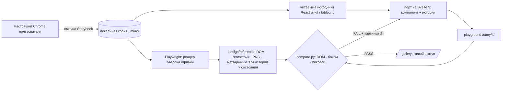

# rt-ui: как мы воспроизвели дизайн-систему Ростелекома на Svelte — и доказали, что она совпадает

> Документ для команды и для блока презентации. Все числа берутся из репозитория (`python tools/metrics.py`), не «на глаз».
> Слайды и сценарий демонстрации — в [`PRESENTATION.md`](PRESENTATION.md), место в плане — в [`PLAN.md`](PLAN.md).

## 1. Коротко

* Задача: сделать **новую** дизайн-систему Ростелекома (gen2) доступной для Svelte «один в один по пикселям» — так требует критерий дизайнеров.
* Готового пакета под Svelte нет. Доступ к актуальным React/Vue-версиям дизайн-системы организаторы участникам **не выдают**: это внутренняя разработка Ростелекома,
  по сути дорогой корпоративный актив. Работали только с тем, что видит любой посетитель публичной документации и Storybook, без внутренних репозиториев и пакетов.
* Мы не рисовали «похоже», а построили **конвейер с машинной проверкой**: эталон снят целиком, каждый компонент портируется и сверяется с ним
  по DOM, геометрии и пикселям в каждом состоянии.
* Результат сейчас: <!--HEADLINE-->**374 из 374 историй (100.0%) проходят попиксельную сверку** во всех проверяемых состояниях (из них 6 — с допуском anti-aliasing: не более 12 краевых пикселей, разница цвета не более 40 уровней; остальные 368 совпадают точно); цель — 100%<!--/HEADLINE-->
* Отдельно готова **таблица `TableGrid`** (24 из 24 эталонных историй) с документацией — основа для всех таблиц CRM.
* Галерея `/gallery` собрана из самой библиотеки, переключает 4 темы и показывает статус каждой истории в реальном времени.


## 2. Задача и ограничения

| Ограничение | Следствие |
|---|---|
| Критерий дизайнеров: максимально точное соответствие новой дизайн-системе | «Похоже» не подходит, нужна проверяемая точность |
| Пакета для Svelte нет; актуальные React/Vue-версии организаторы участникам не выдают (внутренняя разработка) | Опираемся только на публичные материалы; портируем нативно, API оставляем совместимым с React |
| Storybook закрыт WAF для скриптов (`curl` получает «Request Rejected») | Работаем через обычный браузер пользователя; обход защиты не применяем |
| Нужен результат за хакатон, вручную 370+ историй не вычитать | Автоматическая сверка + параллельная разработка с независимой проверкой |
| Таблиц в CRM будет много | Таблица — первый приоритет и отдельный продукт с README |

## 3. Почему не «взять токены и нарисовать»

В исходном плане был вариант «токены + свои компоненты» (3–5 дней, «80% визуального соответствия»). Мы сознательно пошли дальше:

* 80% — это то, что дизайнер заметит сразу (отступ, радиус, состояние hover, поведение выпадающего списка).
* Токены не описывают **поведение**: клавиатуру, порядок закрытия попапов, позиционирование, фокус.
* Без автоматической проверки соответствие держится на честном слове и «глазомере» на первой же правке ломается.

## 4. Метод: «эталон → сверка → порт»



### 4.1. Эталон целиком и офлайн

* Расширение Chrome забрало статику публичного Storybook (бандлы, шрифты, `index.json`) на диск. Локальная копия отдаётся сервером `tools/serve.mjs`,
  и дальше **всё рендерится Playwright без сети**: быстро, параллельно, воспроизводимо.
* Для каждой из 374 историй сняты: канонический DOM, геометрия каждого элемента, скриншоты состояний, метаданные Storybook (аргументы,
  типы пропсов с описаниями, исходный код истории).

### 4.2. Стили не переписываем — забираем 1:1

* Классы дизайн-системы — обычный BEM (`atmr-button--ghost`, `atmr-button--size-m`), без хешей. Значит, Svelte-компонент с **тем же DOM и теми же классами**
  получает те же стили автоматически.
* Выгружены 4 темы (`rtk_default`/`rtk_purple` × light/dark, по 2860 токенов `--atmr-*`), CSS компонентов (1,7 МБ) и шрифт. Файлы тем, присланные заказчиком,
  совпали с выгрузкой токен в токен.
* Иконки (**1349**: 442 размера 16 и 907 размера 24) генерируются скриптом из исходников React.

### 4.3. Исходники вместо гаданий

Бандл Storybook не минифицирован: из него извлечены читаемые модули React (`packages/ui-kit`, `tablegird`, `tree`, `sidemenu`, иконки). Поведение — клавиатуру,
порядок эффектов, параметры Popper — портируем с кода, а не «по картинке».

### 4.4. Детерминизм — иначе сверка бессмысленна

Обе стороны (эталон и наша версия) снимаются в одинаковых условиях: фиксированные дата и часовой пояс, подменённый `Math.random`, одинаковые шрифты,
одинаковый viewport, заморозка анимаций после стабилизации страницы, одни и те же действия пользователя.

## 5. Как доказываем совпадение

`tools/compare.py` для каждой истории и каждого состояния проверяет три вещи:

1. **DOM.** Канонический обход: теги, набор атрибутов, классы, `aria-*`, порядок детей, текст, inline-стили, значения полей. Идентификаторы нормализуются, пути к картинкам сравниваются по имени файла.
2. **Геометрия.** `getBoundingClientRect` каждого элемента; расхождение больше 0,6 px — ошибка с указанием элемента.
3. **Пиксели.** Полностраничный скриншот, допуск **0** (для проверки тем — 3 уровня канала, потому что эталон перекрашивается на лету). Для упавших состояний сохраняются картинки «эталон / наше / diff».

Два честных уровня поверх нулевого допуска — оба видны в отчёте и считаются отдельно, а не выдаются за точное совпадение:

* **Варианты эталона (`tools/snapshot_alts.py`).** Сам React-Storybook не полностью детерминирован: после кликов и наведений сглаживание скруглений и иконок иногда рисуется одним из нескольких способов. Состояние снимается многократно, каждый **различный** вариант сохраняется (`design/reference/<id>/alts/`), и наше состояние проходит, если совпало **точно** с основным или любым собственным вариантом эталона.
* **«AA-only».** Если DOM и геометрия совпали, а пиксели отличаются лишь на скруглениях и иконках — не более 12 краевых пикселей, разница цвета до 40 уровней (различия до 8 уровней принимаются везде), состояние засчитывается с отметкой `AA-only`. `python tools/metrics.py` печатает `stories_pass_exact` и `stories_pass_aa_only`, `compare.py --exact` отключает этот уровень.

Состояния: default, фокус с клавиатуры (Tab), hover, клик и **223 сценария поведения** (`tools/interactions/`): открыть меню, выбрать пункт, стрелки и Enter, ввод в поле,
сортировка и фильтры таблицы, закрытие по Escape и клику вне области, прокрутка.

Проверка тем: `compare.py --theme rtk_purple_dark` снимает эталон вживую в той же теме тем же способом, каким переключает тему тулбар Storybook (подмена класса `Theme_root_*` на `<body>`).
Для тем допуск шире: 3 уровня канала и «AA» до 48 краевых пикселей (Δ ≤ 64), потому что смена класса — полная перерисовка эталона. Значения `style` у позиционированных попперов (`transform`, `width`) в этом режиме не сравниваются: эталон перекрашивается уже после того, как popper измерил элементы, а наш рендер сразу в нужной теме; итоговые пиксели показанного состояния сверяются как обычно. Страницы Design Tokens в темовой проверке не участвуют: они сами выбирают файл темы через `globals`.

Результат последнего прогона по трём остальным темам (`python tools/fill-docs.py` обновляет таблицу):

<!--THEMES-->| Тема | Историй сверено | Проходят | из них с допуском AA | Не проходят |
|---|---|---|---|---|
| Rostelecom · тёмная (`rtk_default_dark`) | 364 | **355** | 19 | 9: `components-file--main`, `components-file--file-preview`, `components-slider--tooltip`, `components-tabs-tabs--size`, `components-wizard-wizardstepshorizontal--controlled-steps`, `tablegrid-tablegrid-actionbar--action-bar-story` |
| Purple · светлая (`rtk_purple_light`) | 364 | **354** | 10 | 10: `components-pickerdate-props--max-date-min-date`, `components-radiobuttons-radiogroup--main`, `components-tabs-tabs--size`, `components-wizard-stepitemhorizontal--states`, `components-wizard-wizardstepshorizontal--controlled-steps`, `components-wizard-wizardstepshorizontal--composite-component` |
| Purple · тёмная (`rtk_purple_dark`) | 364 | **354** | 20 | 10: `components-dropdownmenu--empty`, `components-dropdownmenu--placements`, `components-file--file-preview`, `components-select--main`, `components-slider--tooltip`, `components-tabs-tabs--size` |

_Состояния: default, фокус, hover, клик, открытые списки; допуск 3 уровня канала и «AA» до 48 краевых пикселей (Δ ≤ 64); прогон: `compare.py --theme <тема>`._<!--/THEMES-->


## 6. Как организована разработка

* **Граф зависимостей** компонентов построен автоматически из исходников (`tools/deps.mjs`): порт идёт по уровням — сначала то, от чего зависят другие.
* **Параллельные ИИ-агенты** под управлением инженера: каждой группе компонентов — свой исполнитель со сводом правил (`CONVENTIONS.md`),
  затем **независимая проверка** другим агентом; итоговый судья — не мнение, а `compare.py`.
* **Регрессионный свип** всех историй после крупных изменений. Он поймал реальные дефекты: порядок порталов в `body` (ложные падения десятков историй) и лишний перезапуск слушателей
  в `usePopper` (расхождение на трёх историях `Pagination`). Оба исправлены в общем коде, а не «заплатками» на историю.
* **Фундамент проверен численно:** `usePopper` (позиционирование всех попапов) сверен с React на 113 конфигурациях, `Typography` — на 13; расхождений нет.
* **Честные исключения** документируются, а не прячутся (см. раздел 9).

## 7. Что получилось

<!--METRICS-->| Показатель | Значение |
|---|---|
| Эталонных историй Storybook (gen2) | 374 |
| Групп историй в эталоне | 133 |
| Эталонных скриншотов (все состояния) | 3610 |
| **Историй проходят сверку (DOM + боксы + пиксели)** | 374 из 374 (100.0%) |
| из них только с допуском anti-aliasing (≤12 краевых пикселей, Δ≤40) | 6 |
| Историй не проходят сейчас | 0 |
| Состояний сверено (последний прогон каждой истории) | 3538 |
| Сценариев поведения (`tools/interactions`) | 223 |
| Папок компонентов / файлов `.svelte` | 44 / 152 |
| Строк кода библиотеки (Svelte + TS, без иконок) | 31 187 |
| Файлов историй / строк | 381 / 9 887 |
| Иконок (генерируются из исходников) | 1349 |
| Токенов на тему × тем | 2860 × 4 |
| CSS компонентов, КБ (1:1 из эталона) | 1704 |
| Модулей исходников React для портирования | 510 |

_Данные на 20.09.2026, `python tools/metrics.py`._<!--/METRICS-->

Покрытие по группам эталонного Storybook (проходит / всего):

<!--GROUPS-->| Группа эталона | Проходит / всего |
|---|---|
| Components/Badge | 5 / 5 ✅ |
| Components/Box | 2 / 2 ✅ |
| Components/Breadcrumbs | 5 / 5 ✅ |
| Components/Buttons | 18 / 18 ✅ |
| Components/Checkboxes | 6 / 6 ✅ |
| Components/Chips | 6 / 6 ✅ |
| Components/Counter | 5 / 5 ✅ |
| Components/DropdownMenu | 10 / 10 ✅ |
| Components/File | 7 / 7 ✅ |
| Components/FileUpload | 3 / 3 ✅ |
| Components/FloatingActionButton | 3 / 3 ✅ |
| Components/Input | 15 / 15 ✅ |
| Components/InputCard | 5 / 5 ✅ |
| Components/InputDate | 9 / 9 ✅ |
| Components/InputNumberStepper | 5 / 5 ✅ |
| Components/Loader | 4 / 4 ✅ |
| Components/Multiselect | 16 / 16 ✅ |
| Components/Notification | 10 / 10 ✅ |
| Components/Overlay | 3 / 3 ✅ |
| Components/Pagination | 6 / 6 ✅ |
| Components/PickerDate | 23 / 23 ✅ |
| Components/Popover | 6 / 6 ✅ |
| Components/RadioButtons | 6 / 6 ✅ |
| Components/SegmentedControl | 9 / 9 ✅ |
| Components/Select | 13 / 13 ✅ |
| Components/Slider | 8 / 8 ✅ |
| Components/Stepper | 5 / 5 ✅ |
| Components/Switch | 5 / 5 ✅ |
| Components/Tabs | 11 / 11 ✅ |
| Components/Tag | 6 / 6 ✅ |
| Components/Textarea | 11 / 11 ✅ |
| Components/Tooltip | 6 / 6 ✅ |
| Components/Typography | 1 / 1 ✅ |
| Components/Wizard | 7 / 7 ✅ |
| Design Tokens/Animation | 1 / 1 ✅ |
| Design Tokens/Border | 2 / 2 ✅ |
| Design Tokens/Breakpoint | 1 / 1 ✅ |
| Design Tokens/Colors | 1 / 1 ✅ |
| Design Tokens/Shadow | 1 / 1 ✅ |
| Design Tokens/Size | 1 / 1 ✅ |
| Design Tokens/Spacing | 1 / 1 ✅ |
| Design Tokens/Typography | 1 / 1 ✅ |
| Design Tokens/Z-Index | 1 / 1 ✅ |
| Icons/16 | 13 / 13 ✅ |
| Icons/24 | 13 / 13 ✅ |
| Patterns & Recipes/Accordion | 5 / 5 ✅ |
| Patterns & Recipes/Drawer | 8 / 8 ✅ |
| Patterns & Recipes/Modal | 13 / 13 ✅ |
| Patterns & Recipes/SideMenu | 7 / 7 ✅ |
| Patterns & Recipes/TopMenu | 8 / 8 ✅ |
| TableGrid/TableGrid | 24 / 24 ✅ |
| Tools/ScrollBar | 1 / 1 ✅ |
| Tools/usePopper | 1 / 1 ✅ |
| Tree/Tree | 11 / 11 ✅ |<!--/GROUPS-->

### Таблица `TableGrid` — главный результат для CRM

* 24 из 24 историй: обычная и компактная, пустая, чекбоксы и выбор всех, состояния заголовка, цвет строк, ширина/скрытие колонок,
  сортировка, фильтры (в том числе выпадающие), панели действий, раскрываемые строки и вложенные таблицы, изменение и перестановка колонок,
  липкие шапка/футер/первая колонка, пагинация, бесконечная и предзагрузочная прокрутка.
* Тот же API, что у React-версии; архитектура разбита по функциям (`modules/`), поэтому новые возможности добавляются без переписывания ядра.
* [`README.md`](../src/lib/components/TableGrid/README.md): таблица пропсов, соответствие «React → Svelte», примеры (выбор + панель действий, кастомные ячейки, раскрытие, фильтры, sticky, пагинация).


### Производительность таблицы

* Режим `virtual` (CSS subgrid + ядро `virtua`): **10 000 строк рендерятся за ~190 мс**, в DOM около 30 строк, прокрутка 60 fps, около 8 МБ памяти; 1 000 строк — ~100 мс.
* Без `virtual` 1 000 строк в DOM первый раз рисуются ~2,3 с (было ~2,7 с): около двух третей времени — стили и раскладка браузера для того же DOM, а не JavaScript. Оптимизации порта: метаданные колонки считаются один раз, события наведения и перетаскивания делегируются корню таблицы, поиск выбранных и раскрытых строк идёт по `Set` (слушателей событий стало 113 вместо 24 107).
* Методика, сырые цифры и то, что осталось в оригинальном CSS: `tools/bench/results/table-perf-notes.md`.

### Пример-приложение и графики

* `/examples/crm` — экран CRM «Организации» только из компонентов библиотеки (меню, вкладки, фильтры, `TableGrid` с сортировкой, выбором и пагинацией, `Drawer` на всю высоту, `Modal`, тосты); четыре темы и анимации переключаются в шапке. Сценарий проверяет `tools/check-crm.py`.
* `@lct-testkit/rt-ui/charts` — графики для дашбордов (вне оригинала, в дизайн-системе Ростелекома их нет): `LineChart`, `BarChart`, `DonutChart`/`PieChart`, `Sparkline`. Цвета берутся из токенов `--atmr-*` и работают во всех четырёх темах; SVG без зависимостей; доступность и `prefers-reduced-motion`; пять графиков вместе добавляют ~24 КБ gzip, а без импорта — ничего. Проверка без эталона — `tools/check-charts.py` (4 темы × движение вкл/выкл, подсказки, клавиатура).

### Галерея как живой пример использования

`/gallery` построена из компонентов библиотеки (`Typography`, `Input`, `Select`, `SegmentedControl`, `Switch`, `Button`, `Badge`, `TableGrid`):
переключатель четырёх тем меняет и саму галерею, и все встроенные истории. Режим «Таблица» показывает статус всех 374 историй в нашем `TableGrid`.
Ссылки с параметрами (`/gallery?q=tablegrid&theme=rtk_purple_dark&view=both`) открывают нужное состояние на демонстрации.

## 8. Почему это сильное решение

1. **Доказуемость.** Соответствие эталону — измеримое число, а не утверждение. Любую историю можно проверить на глазах у жюри.
2. **Дизайнерам.** Видят свою систему один в один, в четырёх темах, с теми же состояниями и поведением.
3. **Разработчикам.** API повторяет React-версию: миграция на Vue/React (если потребуется) механическая; есть документация и типы.
4. **Скорость CRM.** Кнопки, формы, выпадающие списки, модальные окна и особенно таблица готовы: экраны собираются, а не верстаются.
5. **Качество на дистанции.** Любая правка проверяется автоматически; регрессия видна сразу, а не после жалобы.
6. **Воспроизводимость.** Весь конвейер — скрипты в репозитории; тот же метод переносится на любую другую дизайн-систему.

### Для кейсодержателя: бесплатный шаг в новый фреймворк

Исходный контекст: актуальные React- и Vue-версии дизайн-системы — внутренняя, дорого стоящая разработка, и организаторы доступ к ним не предоставляют.
Мы **не публикуем результат для всех**: репозиторий остаётся закрытым, шрифт и фирменные ассеты в него не входят. Но для владельца кейса это готовая опора:

* **Бесплатный шаг в Svelte.** Появляется рабочая реализация gen2 на новом фреймворке с доказанным совпадением с эталоном; для команды кейсодержателя это пилот, который иначе
  потребовал бы отдельного проекта, бюджета и месяцев работы.
* **Проверяемость вместо доверия.** Соответствие оригиналу подтверждается не заявлением, а прогоном сверки по каждой истории; владелец может повторить проверку сам.
* **Плавная миграция.** API компонентов повторяет React-версию: часть интерфейсов можно переносить постепенно, не переписывая логику.
* **Конвейер остаётся.** Когда дизайн-система обновится, достаточно переснять эталон и запустить сверку: расхождения перечисляются списком с картинками. Это готовый способ держать
  Svelte-версию в синхроне без ручного ревью.
* **Чистый юридический след.** Работа велась только по публичным материалам, без обхода защиты и без внутренних пакетов; условия передачи и использования согласуются с кейсодержателем.

### Авторские расширения (вне оригинала)

Сверх оригинала мы добавляем небольшой **авторский слой**, который в оригинальной дизайн-системе Ростелекома не существует и поэтому **выключен по умолчанию**:

* Анимации на встроенных средствах Svelte (`transition:`, `animate:flip`, `Spring`, `Tween`) — вместо переноса `react-transition-group`. Они включаются глобально (`ExtMotionProvider mode="svelte"`) или пропом `motion` у компонента.
* Волны анимаций: оверлеи (Popover, Tooltip, DropdownMenu, Modal, Drawer, тосты), календарь (листание месяцев и лет), Accordion (высота), Tabs (скользящий индикатор), SideMenu (ширина и подписи), строки и раскрытие `TableGrid`; тип движения `tween` или `spring`.
* Новые компоненты, которых нет в оригинале: `Progress` (линейный и круговой индикатор) и модуль графиков `@lct-testkit/rt-ui/charts`.
* Точечные улучшения там, где оригинал оставляет пробелы, тоже опциональны и помечены: `TableGrid alignCells` (в оригинале `align` колонки действует только на заголовок, а не на ячейки),
  `Drawer`/`Modal` `fullHeight` (панель на всю высоту, содержимое прокручивается внутри),
  базовый слой `.rt-base` / `ThemeProvider` (оригинальные компоненты не задают шрифт и цвет текста, а наследуют их от корня приложения).
* Правила: расширения лежат в отдельном пространстве `src/lib/ext/` с классами `rt-ext-*`, помечены баннером «вне оригинала» и в документации; уважают `prefers-reduced-motion`.
* **Метрики соответствия не затронуты:** при выключенном режиме DOM и пиксели идентичны оригиналу (это проверяется теми же историями `compare.py`), а при включённом итоговое состояние после анимации совпадает с оригиналом.

Живая демонстрация: `/ext` (анимации) и `/charts` (графики).

## 9. Честно об ограничениях

* **Что значит «история проходит».** Во всех состояниях совпали DOM, геометрия и пиксели. Уровни описаны в разделе 5: точное совпадение, совпадение с одним из **собственных вариантов** эталона и «AA-only» (сглаживание скруглений). Число каждого уровня печатает `python tools/metrics.py`; `--exact` отключает допуск AA.
* **Нестабильность самого эталона.** Сглаживание React после кликов и наведений иногда «переключается» между несколькими вариантами; часть таких состояний мы снимали многократно (`design/reference/*/alts`). Истории с симулированной загрузкой (`Drawer / my-requests`) чувствительны к нагрузке машины: в одном прогоне эталон успевает показать данные, в другом ещё лоадер, поэтому такие состояния перепроверяются поодиночке.
* **Осознанные отличия внутренней реализации.** `usePopper` создаёт экземпляр Popper лениво (опция `lazy`) — так закрытый попап не получает лишних атрибутов, как в эталоне;
  в React это следствие момента перерисовки. Порядок узлов-порталов на верхнем уровне `body` сверяется без учёта порядка (на вид он не влияет; наложения ловятся пикселями).
* **Темы.** Токены совпадают полностью; пиксельная проверка выполнена по всем историям во всех трёх остальных темах для основных состояний (таблица в разделе 5), а не для каждого из ~3500 состояний.
* **Скроллбары.** Headless-Chromium скрывает полосы прокрутки, поэтому их вид сверка не видит (DOM и CSS совпадают с оригиналом, включая кастомный `ScrollBar`); включение видимых скроллбаров для обеих сторон — отдельный этап плана (9г).
* **Производительность.** Оригинальный CSS `TableGrid` (`:nth-last-child`, липкий подвал в `grid-row`) остаётся как есть: 1 000 строк без `virtual` рисуются около 2 с; для больших списков есть режим `virtual`.
* **Лицензия.** Шрифт Rostelecom Basis и фирменные ассеты принадлежат Ростелекому: в публичный репозиторий не помещаем, подключаются локально.

## 10. Как запустить и проверить

```bash
npm install
node tools/up.mjs                                     # зеркало эталона :6006 и playground :5180
python tools/compare.py --match "^tablegrid" --brief   # сверка выбранных историй (PASS/FAIL)
python tools/compare.py --ids components-select--main --theme rtk_purple_dark
python tools/metrics.py                               # сводка чисел
```

Открыть в браузере: `http://127.0.0.1:5180/gallery` (галерея), `http://127.0.0.1:5180/story/<id>` (одна история).

## 11. Структура репозитория

```
src/lib/components/     компоненты (по папкам ui-kit); TableGrid/ — таблица с README
src/lib/styles/         темы, CSS компонентов, шрифты (выгружены из эталона 1:1)
src/lib/{hooks,actions} usePopper, portal, outsideClick ...
src/lib/icons/          1349 сгенерированных иконок
src/stories/            Svelte-версия каждой истории Storybook
src/routes/             /story/[id] (playground), /gallery, /api/*
tools/                  снимок эталона, сверка, метрики, генераторы, интерактивные сценарии
design/                 эталонные данные и исходники React (не для публикации)
docs/                   этот документ, план, материалы презентации
CONVENTIONS.md          правила порта (для разработчиков и агентов)
```
