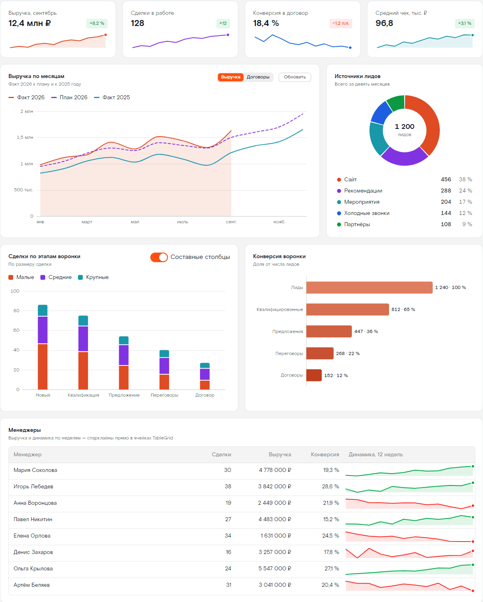
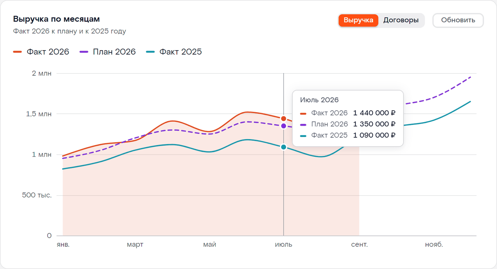
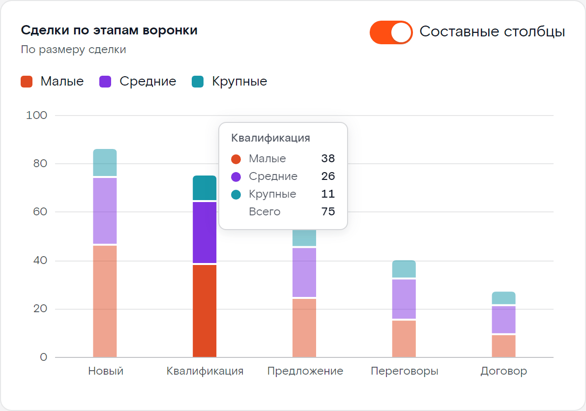
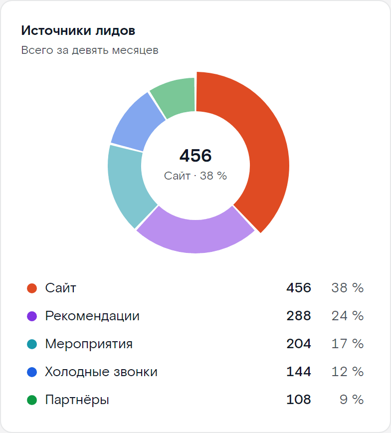
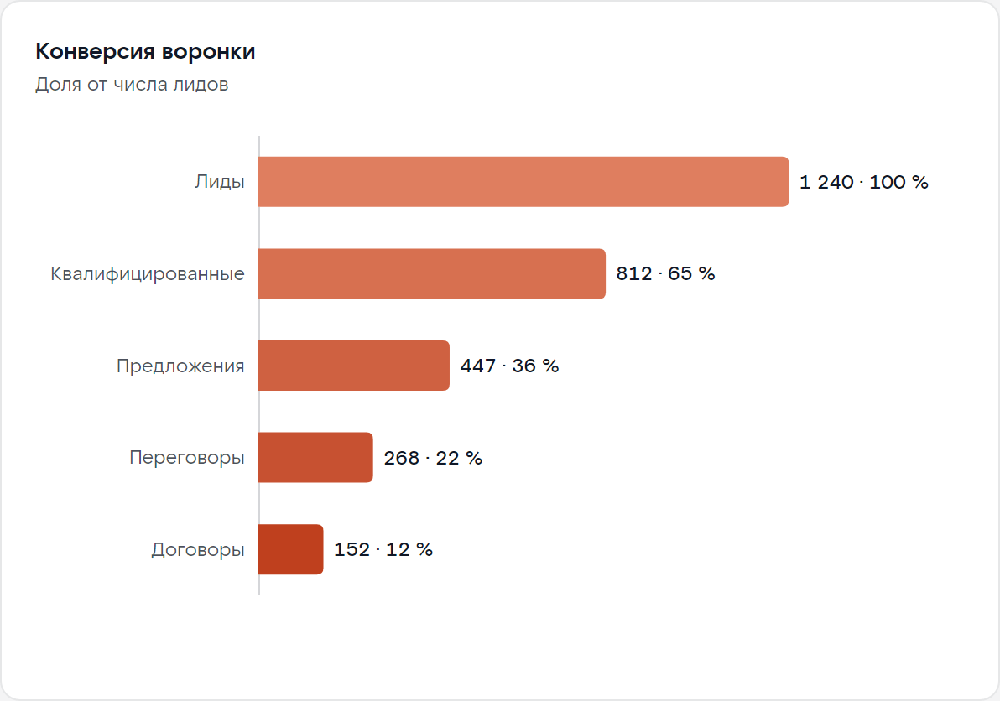
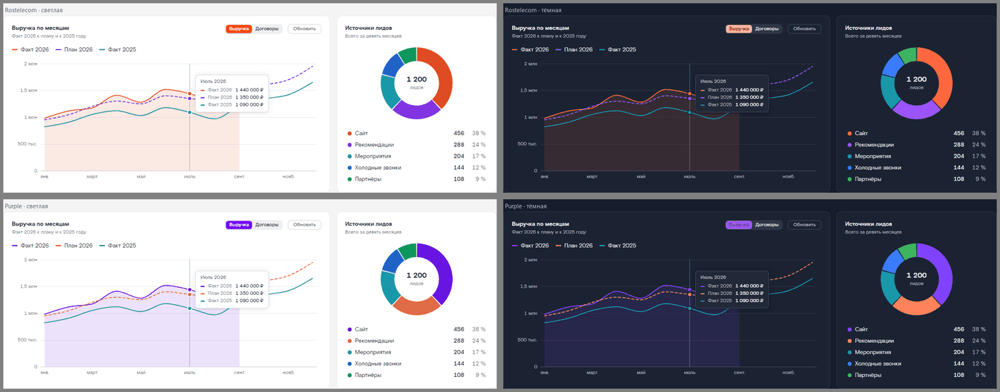

<!-- EXTENSION — author's addition, NOT part of the original Rostelecom design system. Off by default. -->
# rt-ui/charts — графики для CRM (SVG, без зависимостей)

> **Авторский модуль — вне оригинала.** В дизайн-системе Rostelecom Atomaro (gen2) **нет компонентов графиков**: всё, что лежит в `src/lib/charts/`,
> придумано автором и **не является частью оригинала**. Модуль изолирован так же, как `src/lib/ext`: портированные компоненты
> (`src/lib/components/**`) не тронуты, в основной баррель `@lct-testkit/rt-ui` он **не входит**, а тот, кто его не импортирует, не платит за него ни
> байтом JS и CSS (проверено, см. «Пакет»). Движение выключено по умолчанию и подчиняется тому же `ExtMotionProvider`, что и остальные расширения.



| | |
|:-:|:-:|
|  |  |
| *`LineChart`: курсор, подсказка, легенда-переключатель* | *`BarChart`: составные столбцы, зазор 2 px* |
|  |  |
| *`DonutChart` / `PieChart`* | *воронка = горизонтальный `BarChart` + `chartRamp`* |

Четыре темы без единой строки кода (палитра берётся из токенов `--atmr-*`):



## Что внутри

| компонент | что это |
|---|---|
| `LineChart` | линии: несколько серий, прямые или сглаженные (монотонные, без «горбов»), область под линией, точки, курсор + подсказка со всеми сериями, ось из категорий / чисел / дат |
| `BarChart` | столбцы: вертикальные и горизонтальные, сгруппированные и составные, подписи значений, цвет каждого столбца (воронка) |
| `DonutChart`, `PieChart` | кольцо и круг: легенда со значениями и долями, сниппет `center` для середины |
| `Sparkline` | крошечный график без осей для ячейки `TableGrid` или карточки: линия, область или столбики |
| `Legend`, `ChartTooltip`, `Axis`, `Grid` | общие детали: собирайте из них свой график, свою легенду или подсказку |
| `chartColor(i)`, `chartRamp(n, hue)` | цвет i-й серии (`var(--rt-chart-N)`) и одноцветная рампа для **упорядоченных** категорий |
| `niceTicks`, `fitTicks`, `timeTicks`, `linearScale`, `createNumberFormat`, `createCompactFormat`, … | «красивые» деления оси (`fitTicks` ещё и следит, чтобы подписи не налезали друг на друга), календарные деления, форматтеры (`ru-RU`) |

Демо и все варианты — [`/charts`](http://127.0.0.1:5180/charts) (`node tools/up.mjs`; ссылка для слайдов: `/charts?theme=rtk_purple_dark&motion=1`).
Код демо — [`src/routes/charts`](../../routes/charts).

## Быстрый старт

```svelte
<script lang="ts">
  import '@lct-testkit/rt-ui/styles';                                  // темы и шрифт, как для остальных компонентов
  import { ThemeProvider } from '@lct-testkit/rt-ui';
  import { LineChart, BarChart, DonutChart, Sparkline } from '@lct-testkit/rt-ui/charts';   // в этом репозитории: '$lib/charts'

  const months = [
    { month: new Date(2026, 0, 1), fact: 980_000, plan: 950_000 },
    { month: new Date(2026, 1, 1), fact: 1_120_000, plan: 1_050_000 },
    { month: new Date(2026, 2, 1), fact: null, plan: 1_200_000 }        // null = нет значения (разрыв в линии)
  ];
</script>

<ThemeProvider theme="rtk_default_light">
  <LineChart data={months} x="month" smooth area height={300}
    series={[{ key: 'fact', label: 'Факт', y: 'fact' }, { key: 'plan', label: 'План', y: 'plan', dashed: true }]}
    label="Выручка по месяцам: факт и план" />
</ThemeProvider>
```

Данные — обычные массивы объектов, а «что читать из строки» задают **аксессоры**: имя свойства (`x="month"`) или функция `(row, i) => value`.

* **Широкие данные** (`series`): строка = одна позиция по оси X, каждая серия читает своё поле — `{ month, fact, plan }`.
* **Длинные данные** (`y` + `seriesBy`): строка = одна точка, `seriesBy` называет её серию — `{ week, team, score }`.
* Одна серия — просто `y="fact"` (имя серии в подсказке — `yLabel`).

Ось X определяется по значению `x`: `Date` — календарная ось (часы / дни / месяцы / годы), число — числовая, строка — категории (`xType` переопределяет).

## API

Все графики принимают ещё обычные атрибуты корня (`class`, `style`, `data-*`, …) и общие пропсы из таблицы ниже.

### Общие пропсы

| проп | тип | по умолчанию | описание |
|---|---|---|---|
| `label` | `string` | по типу графика | доступное имя графика (`aria-label` картинки): пишите, **что** он показывает |
| `description` | `string` | — | ещё одно предложение в скрытую сводку (вывод для читателя) |
| `emptyText` | `string` | `'Нет данных'` | текст вместо пустого графика |
| `locale` | `string` | `'ru-RU'` | локаль чисел и дат |
| `colors` | `string[]` | палитра | свои цвета серий / долей (любой CSS-цвет, индекс = порядок) |
| `animate` | `MotionProp` | наследуется | движение, см. «Движение»; без `ExtMotionProvider` — **выключено** |

### `LineChart`

| проп | тип | по умолчанию | описание |
|---|---|---|---|
| `data` | `T[]` | обязателен | массив объектов |
| `x` | `Accessor<T, number \| Date \| string>` | обязателен | X строки |
| `y` | `Accessor<T, number \| null>` | — | значение (одна серия или длинные данные) |
| `yLabel` | `string` | `'Значение'` | имя серии при одном `y` |
| `series` | `{ key, label?, y, color?, area?, dashed? }[]` | — | широкие данные; `key` — идентичность серии (цвет и видимость идут за ней) |
| `seriesBy` | `Accessor<T, string>` | — | длинные данные: чем строка называет свою серию |
| `xType` | `'auto' \| 'category' \| 'number' \| 'time'` | `'auto'` | тип оси X |
| `height` / `width` | `number` | `280` / контейнер | высота, px / фиксированная ширина (иначе `ResizeObserver` следит за контейнером) |
| `smooth` | `boolean` | `false` | монотонная кривая вместо ломаной |
| `area` | `boolean` | `false` | заливка под линиями (~12 %); `series[i].area` переопределяет |
| `points` | `boolean` | `false` | маркеры на всех точках (иначе — только под указателем; единственная точка рисуется всегда) |
| `crosshair` / `tooltip` | `boolean` | `true` | вертикальная линия и подсказка на ближайшем X |
| `tooltipContent` | `Snippet<[TooltipModel]>` | — | свои строки подсказки |
| `legend` | `boolean \| 'top' \| 'bottom' \| 'none'` | сверху при 2+ сериях | легенда |
| `grid` | `boolean` | `true` | горизонтальные линии сетки |
| `yTicks`, `yMin`, `yMax`, `yZero` | `number` / `boolean` | по высоте | число делений, края и «включить ноль» (по умолчанию — только с областью); явные `yMin` / `yMax` обрезают всё, что вышло за график |
| `xFormat` | `(x, i) => string` | по типу X | подпись X (ось, подсказка); по умолчанию даты на оси короткие («июл.»), в подсказке и таблице — длинные («Июль 2026») |
| `tickFormat` / `valueFormat` | `(n) => string` | компактный / полный `ru-RU` | ось (`1,3 млн`) / подсказка и сводка (`1 250 000`) |
| `hidden` | `string[]` (`bind:`) | `[]` | ключи скрытых серий; легенда их переключает |
| `onSelect` | `({ index, x }) => void` | — | клик по позиции или Enter |

### `BarChart`

Общие с `LineChart`: `data`, `x` (категория), `y`, `yLabel`, `series` (`{ key, label?, y, color? }`), `seriesBy`, `height`, `width`, `grid`, `legend`, `tooltip`, `tooltipContent`, `yTicks`, `yMin`, `yMax`, `xFormat`, `tickFormat`, `valueFormat`, `hidden`, `onSelect`.

| проп | тип | по умолчанию | описание |
|---|---|---|---|
| `horizontal` | `boolean` | `false` | горизонтальные столбцы, категории слева (подпись в две строки, длинное — с «…») |
| `stacked` | `boolean` | `false` | составные вместо сгруппированных; в подсказке добавляется «Всего» |
| `color` | `Accessor<T, string>` | — | цвет **каждого** столбца одной серии (воронка: `color={(_, i) => ramp[i]}`) |
| `maxBarSize` | `number` | `24` | толще столбец не бывает: столбцы тонкие, остаток слота — воздух |
| `axis` | `boolean` | `true` | ось значений (деления и подписи); выключайте, если у столбцов есть `valueLabels` |
| `valueLabels` | `boolean` | `false` | значения на конце столбца (составного — итог); только там, где помещаются |
| `valueLabel` | `(value, { index, key }) => string` | `valueFormat` | текст подписи: `«1 240 · 100 %»` |

Столбец закруглён 4 px **только** с конца данных, у базовой линии он прямой; между касающимися столбцами и сегментами — зазор 2 px (это геометрия, а не обводка: цвет фона знать не нужно).
Подписи категорий под вертикальными столбцами: в две строки, если так помещаются; иначе — повёрнуты на 35° (узкий график); иначе — прорежены (толпа).

### `DonutChart` и `PieChart`

`PieChart` — тот же компонент с `innerRadius = 0`, без `center` / `centerLabel`.

| проп | тип | по умолчанию | описание |
|---|---|---|---|
| `data` | `T[]` | обязателен | строка = доля |
| `name`, `value` | `Accessor` | обязательны | имя и размер доли (значения ≤ 0 не рисуются, в легенде остаются). Идентичность доли — её имя. Имя называется `name`, а не `label`: `label` занят доступным именем всего графика |
| `color` | `Accessor<T, string>` | палитра по порядку строк | цвет доли |
| `innerRadius` | `number` (0…0,95) | `0.62` | внутренний радиус как доля внешнего |
| `size` | `number` | `220` | диаметр, px |
| `gap` | `number` | `2` | зазор между долями, px (реальный угловой зазор; у единственной доли его нет) |
| `startAngle` | `number` | `0` | угол первой доли, градусы по часовой от 12 часов |
| `legend` | `boolean \| 'none'` | `true` | легенда: значение и доля, клик скрывает долю |
| `center` | `Snippet<[{ total, totalText, active }]>` | итог + подпись | содержимое дырки; `active` — доля под указателем (`{ key, name, value, share, color, index }`) |
| `centerLabel` | `string` | `'Всего'` | подпись под итогом в середине по умолчанию |
| `tooltip` | `boolean` | круг и свой `center` — да, кольцо с серединой по умолчанию — нет | подсказка (у кольца середина и так показывает долю под указателем) |
| `valueFormat`, `hidden`, `onSelect` | | | как выше; `onSelect({ index, name, value })` |

Кольцо и круг годятся для «части от целого» при шести и менее долях; чтобы сравнить близкие значения, берите столбцы. Клик по доле (или Enter на ней) вызывает `onSelect`.

### `Sparkline`

| проп | тип | по умолчанию | описание |
|---|---|---|---|
| `data` | `T[]` (числа или объекты) | обязателен | значения |
| `y` | `Accessor<T, number>` | — | для объектов |
| `type` | `'line' \| 'area' \| 'bar'` | `'line'` | линия, линия с областью, столбики |
| `width` / `height` | `number` | контейнер / `28` | px |
| `color` | `string` | `var(--rt-chart-1)` | любой CSS-цвет (в таблице: `var(--atmr-success-default)` / `var(--atmr-error-default)` по знаку тренда) |
| `smooth`, `endDot`, `min`, `max` | | `false`, для линии `true`, по данным | кривая, маркер на последнем значении, границы по вертикали |
| `label`, `locale`, `valueFormat`, `animate` | | `'Динамика'` | доступное имя; сводка значений дописывается к нему |

```svelte
<script lang="ts">
  import { TableGrid, type TableGridColumn } from '@lct-testkit/rt-ui/components/TableGrid';
  import { Sparkline } from '@lct-testkit/rt-ui/charts';
  const columns: TableGridColumn<Row>[] = [
    { name: 'name', title: 'Менеджер' },
    { name: 'weeks', title: 'Динамика, 12 недель', size: { width: 'minmax(180px, 1.4fr)' }, render: trend }
  ];
</script>

{#snippet trend(row: Row)}
  <Sparkline data={row.weeks} type="area" height={32} label="Выручка {row.name} по неделям"
    color={row.weeks.at(-1)! >= row.weeks[0] ? 'var(--atmr-success-default)' : 'var(--atmr-error-default)'} />
{/snippet}

<TableGrid {columns} rows={rows} />
```

Спарклайн занимает ширину ячейки (`ResizeObserver`), до первого замера — 96 px; лежит в потоке как `inline-block`, высоту задаёт `height`.

### Общие детали

| компонент | пропсы |
|---|---|
| `Legend` | `items: { key, label, color, hidden?, marker?: 'line' \| 'rect' \| 'dot', value?, secondary? }[]`, `onToggle(key)`, `onHighlight(key \| null)`, `layout: 'row' \| 'column'`, `label` |
| `ChartTooltip` | `model: { index, title, rows: { key, label, text, color, active?, shareText? }[] } \| null`, `x`, `y`, `width`, `height` (в px внутри графика), `opacity`, `offset`, `marker`, `content` |
| `Axis` | `ticks: { value, pos, label, lines? }[]`, `orient: 'bottom' \| 'left'`, `length`, `gap`, `line`, `anchorOf`, `rotate` |
| `Grid` | `ticks`, `orient: 'horizontal' \| 'vertical'`, `length` |

`Axis` и `Grid` — фрагменты `<g>` для вставки внутрь `<svg>`; деления считайте `fitTicks(min, max, длина_px, сколько_хотим)` (или `niceTicks(min, max, count)`) и `timeTicks(min, max, count)`.

## Форматирование: русский по умолчанию

Числа и даты идут через `Intl` с локалью `ru-RU`: подсказка — `1 250 000`, ось — компактно `1,3 млн` / `500 тыс.`, месяц — `Июль 2026`, ось времени — `янв.`, `5 сент.`.
Любой формат заменяется: `valueFormat={(v) => rub(v)}`, `tickFormat`, `xFormat`; готовые: `createNumberFormat(locale, Intl-опции)`, `createCompactFormat`, `createPercentFormat`, `createLongDateFormat`, `createMonthYearFormat`.
Тексты интерфейса (`Ряды`, `Данные`, `Всего`, `Нет данных`, скрытая сводка) — русские; `emptyText`, `label`, `description`, `centerLabel` задаются пропсами.

## Цвета и темы

Цвета берутся **только** из токенов дизайн-системы (`--atmr-*`), поэтому четыре темы работают без кода. Категориальная палитра — CSS-переменные
**`--rt-chart-1 … --rt-chart-10`** и `--rt-chart-other` (серый «Другое»), заданные на каждом `.rt-chart` и на классе `.rt-chart-palette`
(повесьте его на любой элемент, чтобы взять цвет вне графика, например точку в ячейке таблицы: `style="background: var(--rt-chart-3)"`).

| № | основа (шаг рампа) | Rostelecom | Purple |
|---|---|---|---|
| 1 | `accent-500` | оранжевый | фиолетовый |
| 2 | `status-01-400` | фиолетовый | коралловый |
| 3 | `status-04-500` | бирюзовый | бирюзовый |
| 4 | `info-500` | синий | синий |
| 5 | `success-500` | зелёный | зелёный |
| 6 | `status-05-500` | маджента | маджента |
| 7 | `warning-600` | янтарный | янтарный |
| 8 | `status-03-500` | голубой | голубой |
| 9 | `status-06-500` | малиновый | малиновый |
| 10 | `status-02-400` | индиго | индиго |

В темах Purple токены `accent` и `status-01` меняются местами, поэтому **слот 1 — всегда фирменный цвет темы**, а слот 2 — второй фирменный.
Каждый цвет сдвинут на `--rt-chart-tint` (12 %) к цвету текста темы (`color-mix(in oklab, var(--atmr-fg-default) 12%, …)`): на светлой поверхности он чуть темнее,
на тёмной чуть светлее; так один и тот же шаг рампа держит ≥ 3:1 к поверхности в обеих. `--rt-chart-tint: 0%` возвращает «чистые» токены.

**Как проверено** (`tools/check-charts.py` читает готовые цвета из Chromium и прогоняет шесть проверок метода валидации палитры на поверхности `--atmr-bg-surface1` каждой темы):
контраст к поверхности ≥ 3:1 (минимум 3,4 на светлых темах и 3,1 на тёмных), различимость соседних цветов при дейтеранопии / протанопии ΔE ≥ 8 (худшая пара по четырём темам — 12,3) и при нормальном зрении ≥ 15 (худшая — 16,8),
цветность ≥ 0,10. Отклонение, о котором честно: на тёмных темах три цвета (оранжевый / коралловый, зелёный, янтарный) светлее рекомендованной полосы L 0,48–0,67 на 0,01–0,07 — они ярче, не тусклее.
Тексты держат ≥ 4,5:1: подписи осей, доли в легенде, подпись в середине кольца и строки подсказки — `--atmr-fg-soft` (7,9:1 на белом), легенда — `--atmr-fg-default`; «приглушённый» `--atmr-fg-muted` дизайн-системы (3,96:1 на белом) значимому тексту не достаётся — только выключенному пункту легенды.

**Как переопределить** (значения по умолчанию заданы с нулевой специфичностью — `:where`):

```svelte
<LineChart … colors={['var(--atmr-success-default)', '#0a6cff']} />                <!-- свойством: индекс = порядок серий -->
<LineChart … style="--rt-chart-1: #0a6cff" />                                        <!-- переменной на самом графике -->
```
```css
.dashboard .rt-chart { --rt-chart-1: #0a6cff; --rt-chart-2: #ff8a00; }              /* правилом, которое целится в график */
```

Ещё настройки (можно задавать на любом предке, у них есть запасное значение из токенов): `--rt-chart-surface` (цвет зазоров и колец у маркеров, по умолчанию `--atmr-bg-surface1`; если карточка
другого цвета — задайте его), `--rt-chart-grid`, `--rt-chart-axis`, `--rt-chart-text`, `--rt-chart-tint`.

Правила выбора цвета: **цвет идёт за сущностью, а не за местом в списке** — серии красятся по индексу в *вашем* списке серий, скрытие одной не перекрашивает остальные;
больше десяти серий — не добавляйте оттенки, сворачивайте хвост в «Другое» (`--rt-chart-other`). Красный (`error`) в палитру не входит; зелёный (слот 5) и янтарный (слот 7) — обычные категориальные цвета:
если серия *значит* «хорошо / плохо» (успешные / провальные сделки, рост / падение), красьте её статусными токенами `--atmr-success-default` / `--atmr-error-default` и не смешивайте это с категориальными цветами в одном графике.
Для **упорядоченных** категорий (этапы воронки, тарифы) — не палитра, а одноцветная рампа: `chartRamp(5)` даёт пять оттенков `accent` от светлого к тёмному (ступени 300 → 600, оба конца ≥ 2:1 на светлой и тёмной поверхности).

## Движение

Выключено по умолчанию — как у остальных расширений. Включается пропсом `animate` (тип `MotionProp`, тот же, что у `motion` в `ext`) или глобально `ExtMotionProvider`:

```svelte
<ExtMotionProvider mode="svelte" type="spring" overrides={{ chart: 'off' }}>   <!-- весь режим включён, а графики — нет -->
  <LineChart … animate />                        <!-- свой проп сильнее провайдера: включено -->
  <LineChart … animate="spring" />
  <LineChart … animate={{ duration: 600, easing: 'expressive-standard' }} />
  <LineChart … animate={false} />               <!-- выключено, даже если провайдер включён -->
</ExtMotionProvider>
```

Приоритет: `animate` графика → `overrides.chart` провайдера → `mode` провайдера → выключено; `prefers-reduced-motion: reduce` выключает всё **всегда**.
Движение только Svelte-нативное — `Tween` / `Spring` (`svelte/motion`), `svelte/easing`; CSS-`transition` не используется.

| что | как двигается |
|---|---|
| появление (draw-in) | линии «прорисовываются» слева направо (растущий `clipPath`), столбцы вырастают от базовой линии по очереди, кольцо разворачивается по часовой, спарклайн прорисовывается; 800 мс, `cubicOut`, если время не задано пропсом |
| смена данных | числа (значения, границы оси, видимость серий) плавно едут к цели через `Tween` / `Spring` провайдера (по умолчанию 300 мс, `productive-standard`); форма массива изменилась (другое число точек) — без анимации, сразу |
| наведение | активная категория / доля остаётся, остальные отступают; при наведении на пункт легенды остальные серии отступают; активная доля кольца выступает на 6 px |
| курсор и подсказка | скользят к ближайшей позиции коротким `Tween` (140 мс) |

Без движения каждое значение — это ровно цель: ни лишнего кадра, ни таймеров, ни объектов анимации. **Конечное состояние с движением и без него одинаково** — это проверяет `tools/check-charts.py`
(геометрия линий, столбцов, долей после анимации совпадает до 0,06 px).

## Доступность

* Картинка — `<svg role="img" aria-label="…">`, рядом визуально скрытый блок: `aria-describedby` указывает на **сводку** («Выручка: 12 значений, минимум … (Январь), максимум …, последнее …»), затем **таблица данных** (до 400 строк) — эквивалент графика для скринридера.
* Точки данных — настоящие `<button>` в одной группе `role="group"` с **одной** остановкой Tab (roving tabindex): Tab входит в график на последней точке, стрелки / `Home` / `End` двигают, `Enter` / `Space` — `onSelect`, `Escape` закрывает подсказку, следующий Tab выходит. Точка получает ту же подсказку, что и указатель; у области графика видна рамка фокуса.
* Каждая кнопка называет позицию целиком: «Январь 2026: Факт — 980 000 ₽; План — 950 000 ₽».
* Легенда — кнопки-переключатели (`aria-pressed`); последнюю видимую серию скрыть нельзя. Подсказка — только для глаз (`aria-hidden`): тот же текст лежит в `aria-label` кнопок и в таблице. Подсказка ничего не решает сама: значения доступны и без неё.
* Цвет — не единственный признак: легенда с формой значка, подписи, подсказка, таблица; пунктир для плана.
* Контраст: метки и текст ≥ 4,5:1, метки данных ≥ 3:1 (см. «Цвета»); при `prefers-reduced-motion: reduce` движения нет.
* Пустые данные — текст «Нет данных» с той же ролью `img` и именем; одна точка — маркер и подпись; нули, отрицательные значения и `null` не ломают геометрию (`NaN` нигде не появляется — это проверяет тест).

## Поведение без сюрпризов

* **Адаптивность.** График следит за шириной контейнера (`ResizeObserver`); до первого замера (сервер, первая отрисовка) рисуется на 560 × 280 с `viewBox`, поэтому серверный HTML не пуст и не «прыгает» по вертикали (высота задана пропсом).
* **Подсказка не двигает вёрстку.** Она `position: absolute` внутри графика, всегда в DOM (невидима, пока закрыта), ставится справа от курсора и переворачивается к левому краю, оставаясь внутри графика. Если график лежит в контейнере с `overflow: hidden` — подсказка обрезается им, как и всё остальное.
* **SSR.** Модуль не трогает `window` / `document` при импорте; сервер отдаёт готовый график (при включённом движении — уже дорисованный, анимация стартует на клиенте). Проверяет `tools/check-charts-ssr.mjs`.
* **Пустой массив, одна точка, только нули, `null` внутри, повторяющиеся имена долей, 200 и больше точек** — обработаны (см. страницу `/charts`, блок «Варианты и состояния»).

## Чего здесь нет (и почему)

Нет двойной оси Y (два масштаба на одном графике порождают несуществующие корреляции — рисуйте два графика), нет 3D, нет панорамирования / масштабирования / кисти, нет областей с накоплением, точечных и тепловых диаграмм,
нет автоматической подписи каждой точки (подписи выборочные: конец, экстремум, `valueLabels` только там, где помещаются). Модуль — набор графиков для панели CRM, а не библиотека визуализации.

Известные ограничения:

* Ширины подписей оцениваются по числу знаков (шрифт не измеряется: так работает SSR): другой, более широкий шрифт может сдвинуть перенос / поворот подписей на границе.
* Палитра из 10 цветов; серии выше десятого повторяют цвета (`chartColor(i)` берёт `i mod 10`) — сворачивайте хвост.
* Подписи категорий на оси линейного графика при нехватке места прореживаются (у столбцов — переносятся и поворачиваются).
* Составной столбец со значениями разных знаков: «итог» в подписи — сумма со знаками.
* Даты — в локальном часовом поясе браузера.
* Нужны `color-mix()` (Chrome 111+, Safari 16.2+, Firefox 113+; без него — запасные «чистые» шаги рампов) и `:has()` для рамки фокуса.
* `TableGrid` с `alignCells` ставит класс выравнивания на ячейки тела, но CSS порта стилизует его только у заголовка; в демо числа выровнены локальным правилом.

## Что лежит в папке

```
src/lib/charts/
  index.ts                     публичный вход: `@lct-testkit/rt-ui/charts` (в баррель `@lct-testkit/rt-ui` не входит)
  LineChart.svelte  BarChart.svelte  DonutChart.svelte  PieChart.svelte  Sparkline.svelte
  Legend.svelte  ChartTooltip.svelte  Axis.svelte  Grid.svelte
  types.ts                     типы пропсов и моделей
  charts.css                   все стили и палитра (`--rt-chart-*`); подключается только самими компонентами
  internal/                    шкалы и «красивые» деления, пути (ломаная, монотонная кривая, дуга, столбец), форматирование,
                               данные (широкие / длинные), палитра, движение (обёртка над ext), размер (ResizeObserver), активная позиция и клавиатура
src/routes/charts/             демо `/charts`
tools/check-charts.py          проверка поведения + скриншоты (docs/img/charts-*.png)
tools/check-charts-ssr.mjs     проверка серверного рендера
tools/size-charts.mjs          размер модуля в сборке потребителя
tools/ssr-wrap.svelte          вспомогательный файл серверной проверки (график внутри `ExtMotionProvider`)
```

## Проверка

```bash
node tools/up.mjs                                   # playground на :5180
python tools/check-charts.py                        # 4 темы × движение выкл / вкл, reduced motion, узкие окна, SSR, скриншоты
python tools/check-charts.py --quick --no-shots     # 2 темы, без узких окон и скриншотов
python tools/check-charts.py --shots-only           # только docs/img/charts-*.png
node tools/check-charts-ssr.mjs                     # серверный рендер
npm run package && node tools/size-charts.mjs       # размер и «не тянет ничего лишнего»
```

Оригинала для сверки нет, поэтому проверяется сам модуль: число элементов в каждом графике (линии, области, столбцы, доли, точки, пункты легенды, кнопки, строки скрытой таблицы), отсутствие `NaN`,
разумные деления оси (3–8, равномерные «красивые», без наложения подписей), палитра на поверхности каждой темы (контраст, соседние цвета для дальтоников), подсказка по наведению и с клавиатуры без сдвига вёрстки,
легенда (скрыть / показать / последнюю нельзя / выделение), одна остановка Tab, кольцо (середина, легенда, клавиатура), морфинг и draw-in с движением, мгновенность без него и при `prefers-reduced-motion`, равенство конечной геометрии, данные, пришедшие позже пустого состояния (draw-in), пересчёт при изменении ширины окна на лету, соглашение `animate` > `overrides.chart` > `mode` (в SSR-проверке),
отсутствие ошибок и предупреждений в консоли.

## Пакет

`package.json` → `exports["./charts"]` (как `./ext`): `types` → `dist/charts/index.d.ts`, `svelte` / `default` → `dist/charts/index.js`; отдельные файлы — `@lct-testkit/rt-ui/charts/LineChart.svelte`. `npm run package` собирает модуль вместе с остальным
(типы для обобщённых компонентов `LineChart<T>` … генерируются), `publint` и `attw` для `./charts` зелёные (ESM, bundler).

**Не платит тот, кто не импортирует.** `"sideEffects": ["**/*.css"]` сохранён; модуль не входит в основной баррель; его CSS подключает `import './charts.css'` в самих компонентах (не общий слой), а из `ext` берётся только `motion.svelte.js` без CSS.
`node tools/size-charts.mjs` строит приложение-потребитель из собранного пакета (`vite build`) и доказывает: страница с одной `Button` из барреля **не содержит ни кода, ни CSS графиков**.

Что модуль добавляет к такой странице (gzip; JS включает рантайм `Tween` / `Spring` и слой движения `ext`, которых у страницы с одной кнопкой нет):

| страница | JS | CSS | итого |
|---|---|---|---|
| Button + `Sparkline` | +8,2 КБ | +1,8 КБ | **+10,0 КБ** |
| Button + `LineChart` | +14,7 КБ | +1,8 КБ | **+16,5 КБ** |
| Button + все пять графиков | +22,2 КБ | +1,8 КБ | **+24,0 КБ** |

`dist/charts/charts.css` — 12,9 КБ до сжатия (с комментариями), 3,0 КБ gzip; в сборке потребителя после минификации — 7,7 КБ / 1,8 КБ gzip.
Новых зависимостей в `package.json` нет.
